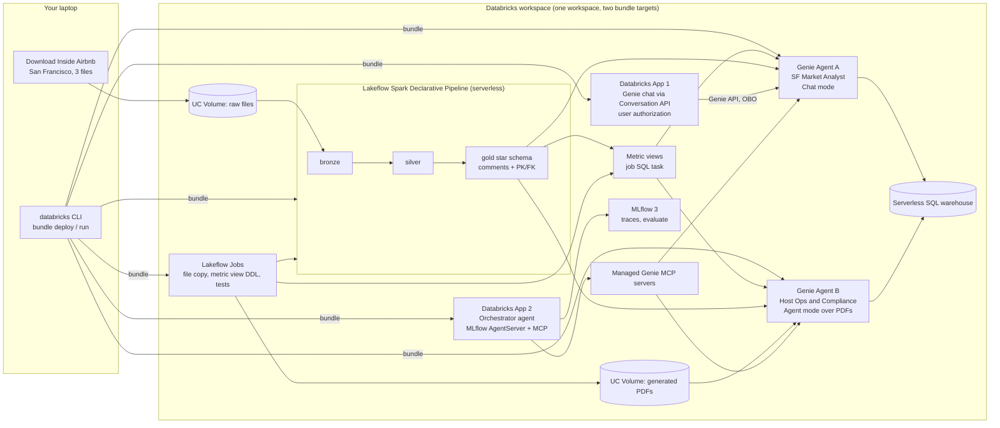

# Databricks Genie in Production

[](https://github.com/zoltanctoth/databricks-genie-in-production/actions/workflows/main.yml)
[](https://github.com/zoltanctoth/databricks-genie-in-production/actions/workflows/release.yml)

A production reference architecture and hands-on tutorial for Databricks AI/BI Genie. You build a complete, deployable Genie stack on a standard Databricks workspace: a semantic layer with Unity Catalog metric views, two curated Genie Agents with benchmarks, a Databricks App on the Genie API, a custom orchestrator agent over MCP, and dev/prod deployment with Declarative Automation Bundles.

Written for Databricks practitioners who know SQL, Python and Unity Catalog but are new to Genie. Every step is reproducible on any Databricks workspace with Unity Catalog and serverless compute, on any cloud.

> **Status:** work in progress. The live progress marker is in [.dev/plan.md](.dev/plan.md#5-where-we-are).

## What you will build



The three pillars, and what each module teaches:

| Pillar | What you build | What you learn |
|---|---|---|
| **Semantic layer** | Gold star schema with comments and PK/FK constraints; metric views with agent metadata and snowflake joins, deployed by a job SQL task | Why curation starts in Unity Catalog, why Databricks puts metric views under Genie, and where the approach stops |
| **Genie Agents** | Agent A (Chat mode) over metric views and gold tables; Agent B (Agent mode) over PDFs in a volume; benchmarks for each | How a Genie Agent produces an answer, what each curation feature does to quality, how to measure and operate it |
| **Productionizing** | One bundle with `dev` and `prod` targets; GitHub Actions CI/CD with integration tests; Genie JSON promotion; a Genie chat app; an orchestrator agent consuming both Genie Agents over MCP, evaluated with MLflow 3 | How Genie goes from a workspace toy to a deployed, versioned, monitored component |

## Repository layout

```
README.md                          # this file
.dev/plan.md                       # working plan and live progress marker
.github/workflows/                 # CI/CD: pr.yml, main.yml, release.yml
docs/
  01-requirements-and-risks.md     # requirements, decisions, risk register
  02-architecture.md               # build specification: tables, rules, metric views
  research/                        # source-cited research appendices
bundle/
  databricks.yml                   # bundle, variables, dev and prod targets
  scripts.yml, scripts/            # one-time admin scripts (prod managers group)
  resources/                       # one YAML file per resource: schemas, pipeline, jobs
  src/
    pipeline/                      # bronze, silver and gold (SQL)
    metric_views/                  # one .sql file per metric view
    tests/                         # SQL assertions run by the tests job
    setup/                         # notebook that copies the source files into the volumes
```

Genie JSON, apps and evaluation code land under `bundle/` as each component is built.

## Start here

1. Read [docs/01-requirements-and-risks.md](docs/01-requirements-and-risks.md) for the requirements and decisions, and [docs/02-architecture.md](docs/02-architecture.md) for the build specification.
2. Check [.dev/plan.md](.dev/plan.md#5-where-we-are) for what is built and what is next.
3. The research appendices in [docs/research/](docs/research/) hold the detailed findings with source URLs and page dates. Re-verify anything dated before you build on it; Databricks renamed half of this stack in 2026.

## Deploying the bundle

The bundle has two targets in one workspace. `dev` (development mode) prefixes every schema with `dev_<user>_`, so each developer and CI get their own copy; `prod` runs as a service principal.

One-time prerequisites per workspace:

1. **Catalog.** The catalog named by `var.catalog` is shared by both targets, so the bundle never owns it. Create it once (on a workspace with Default Storage, in Catalog Explorer with **Use default storage** ticked; the API cannot).
2. **Service principal.** Put its application ID in the `service_principal` variable and grant it `USE CATALOG` and `CREATE SCHEMA` on the catalog. Schema-level grants are declared in `databricks.yml`.
3. **File access.** `setup_workspace` reads the source files from a raw `s3a://` path, which needs the legacy `SELECT ON ANY FILE` privilege. Workspace admins have it implicitly; grant it to the service principal: ``GRANT SELECT ON ANY FILE TO `<application-id>` ``. The production alternative is a Unity Catalog external location with an external volume, which scopes access to one prefix.
4. **SQL warehouse.** The `warehouse_id` variable looks up `Serverless Starter Warehouse` by name; change it if yours differs.

Deploy and build a target by hand:

```bash
databricks bundle deploy -t dev --profile <your-profile>
databricks bundle run setup_workspace -t dev --profile <your-profile>      # copy source files (idempotent)
databricks bundle run airbnb_pipeline -t dev --profile <your-profile>      # bronze, silver, gold
databricks bundle run deploy_metric_views -t dev --profile <your-profile>  # metric views (SQL task)
databricks bundle run tests -t dev --profile <your-profile>                # regression tests
```

Metric views are created by a job SQL task, not by the pipeline: Lakeflow Spark Declarative Pipelines accept only materialized views and streaming tables, and bundles have no metric view resource.

Pass `--profile` explicitly. If your shell exports `DATABRICKS_CLIENT_ID` for a service principal, a bare `bundle deploy` silently deploys as that principal.

## CI/CD

GitHub Actions with the Databricks CLI, signed in as the service principal:

| Trigger | Workflow | What runs |
|---|---|---|
| Pull request to `main` | `pr.yml` | `bundle validate --strict` for both targets; the prod deployment plan in the run summary |
| Merge to `main` | `main.yml` | Deploy `dev` as the service principal (its own `dev_<sp>_*` schemas), then copy files, pipeline, metric views, tests |
| Merge to `release` | `release.yml` | Deploy `prod`, then the same chain with the tests as a smoke test |

Setup: GitHub environments `ci` and `prod`, each with variables `DATABRICKS_HOST` (full `https://` URL) and `DATABRICKS_CLIENT_ID` (application ID) and secret `DATABRICKS_CLIENT_SECRET` (an OAuth secret of the service principal); restrict `prod` to the `release` branch. Workload identity federation removes the secret but needs a Databricks account admin to create a federation policy on the service principal.

Prod is deployed only as the service principal. Whoever deploys first owns the schemas, volumes and pipeline, and only an admin can change that later; a personal prod deploy blocks the next release. For a manual prod deploy, use the service principal's profile from a clean checkout of `release`.

## GitHub metadata

Suggested repository description:

> Production reference architecture and hands-on tutorial for Databricks AI/BI Genie: metric views as the semantic layer, Genie Agents with benchmarks and evaluation, Databricks App on the Genie API, MCP orchestration, and dev/prod deployment with Declarative Automation Bundles.

Suggested topics: `databricks`, `genie`, `ai-bi`, `text-to-sql`, `metric-views`, `unity-catalog`, `mcp`, `reference-architecture`, `tutorial`.

## Data attribution

Data: Inside Airbnb (insideairbnb.com), San Francisco snapshot 2026-06-14, licensed under CC BY 4.0. Modified: filtered, cleansed and aggregated for teaching. Students download the raw files themselves; this repository redistributes only derived artifacts.
