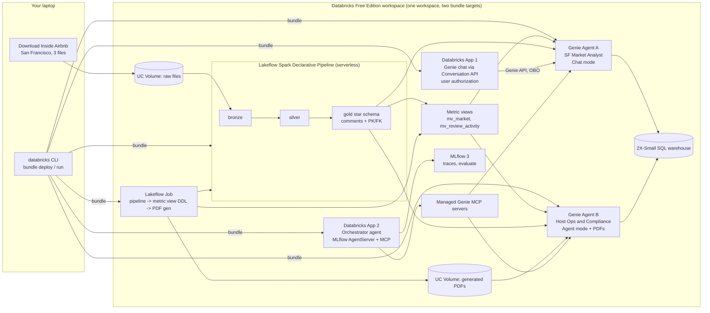

# Databricks Genie in Production

A production reference architecture and hands-on tutorial for Databricks AI/BI Genie. You build a complete, deployable Genie stack on **Databricks Free Edition**: a semantic layer with Unity Catalog metric views, two curated Genie Agents with benchmarks, a Databricks App on the Genie API, a custom orchestrator agent over MCP, and dev/prod deployment with Declarative Automation Bundles.

Written for Databricks practitioners who know SQL, Python and Unity Catalog but are new to Genie. Every step is reproducible on a free account.

> **Status:** work in progress. The live progress marker is in [.dev/plan.md](.dev/plan.md#5-where-we-are). The build runs 2026-10-02 to 2026-10-15.

## What you will build



The three pillars, and what each module teaches:

| Pillar | What you build | What you learn |
|---|---|---|
| **Semantic layer** | Four-table gold star schema with comments and PK/FK constraints; two metric views with snowflake joins, composed measures and window measures | Why curation starts in Unity Catalog, why Databricks puts metric views under Genie, and where the approach stops |
| **Genie Agents** | Agent A (Chat mode) over metric views; Agent B (Agent mode) over tables plus PDFs in a volume; 20+ benchmarks each | How a Genie Agent produces an answer, what each curation feature does to quality, how to measure and operate it |
| **Productionizing** | One bundle with `dev` and `prod` targets; Genie JSON promotion workflow; a Genie chat app; an orchestrator agent consuming both Genie Agents over MCP, evaluated with MLflow 3 | How Genie goes from a workspace toy to a deployed, versioned, monitored component |

## Repository layout

```
README.md                          # this file
.dev/plan.md                       # working plan and live progress marker
docs/
  01-requirements-and-risks.md     # requirements, decisions, two-week plan, risk register
  research/                        # source-cited research appendices (Genie, metric views,
                                   # bundles, agent framework, dataset), verified 2026-10-01
```

The bundle, pipeline, SQL, Genie JSON, apps and evaluation code land under `resources/`, `src/` and `eval/` as the build progresses. The target layout is in [docs/01-requirements-and-risks.md, section 7.5](docs/01-requirements-and-risks.md#75-bundle-layout).

## Start here

1. Read [docs/01-requirements-and-risks.md](docs/01-requirements-and-risks.md) for the architecture, decisions and plan.
2. Check [.dev/plan.md](.dev/plan.md#5-where-we-are) for what is built and what is next.
3. The research appendices in [docs/research/](docs/research/) hold the detailed findings with source URLs and page dates. Re-verify anything dated before you build on it; Databricks renamed half of this stack in 2026.

## GitHub metadata

Suggested repository description:

> Production reference architecture and hands-on tutorial for Databricks AI/BI Genie: metric views as the semantic layer, Genie Agents with benchmarks and evaluation, Databricks App on the Genie API, MCP orchestration, and dev/prod deployment with Declarative Automation Bundles. Runs on Free Edition.

Suggested topics: `databricks`, `genie`, `ai-bi`, `text-to-sql`, `metric-views`, `unity-catalog`, `mcp`, `reference-architecture`, `tutorial`.

## Data attribution

Data: Inside Airbnb (insideairbnb.com), San Francisco snapshot 2026-06-14, licensed under CC BY 4.0. Modified: filtered, cleansed and aggregated for teaching. Students download the raw files themselves; this repository redistributes only derived artifacts.
