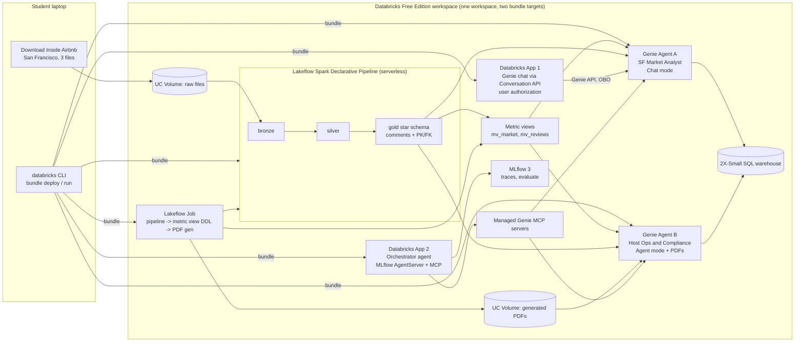

# Genie in Production: Reference Architecture and Course

## Requirements Analysis and Risk Register

| | |
|---|---|
| **Status** | Draft v0.2 (v0.1 2026-10-01; v0.2 simplified data model, San Francisco) |
| **Date** | 2026-10-01 |
| **Author** | Zoltan Toth (with Claude as research and drafting assistant) |

Everything factual in this document was checked against the Databricks documentation on 2026-10-01. Page dates are given where they matter. The five appendices in `docs/research/` hold the detailed findings with source URLs. Items marked **[verify]** could not be confirmed from documentation and are scheduled for the Day 1 feasibility spike.

---

## 1. Purpose and context

Most Genie material online stops at "create a space, ask a question". This project covers the three areas that decide whether Genie works in production: Genie Agents (curation, quality, operation), the Databricks semantic layer (Unity Catalog metric views), and productionizing Genie with Declarative Automation Bundles. It does so by building a complete, runnable reference architecture on Databricks Free Edition, and then turning that build into a Udemy or YouTube course for Databricks practitioners who are new to Genie.

The two-week build optimizes for a working, end-to-end stack with deep coverage of Genie curation and metric views. Course polish (recordings, every click shown) is a later pass. Students need a reproducible capstone on a free workspace.

## 2. What changed since 2022 (orientation)

Many practitioners last worked hands-on with Databricks before the 2024 to 2026 wave of renames. The following renames and shifts are confirmed and matter for this project. Several of them also matter for course shelf life (see risk R-12).

| Then | Now | Notes |
|---|---|---|
| Genie Spaces | **Genie Agents** | API and SDK still use `space_id` and `/api/2.0/genie/spaces`. |
| Research Agent (Genie) | **Agent mode** | Multi-step reasoning, reports, citations. Only Agent mode reads files. |
| Databricks One | **Genie One** | Business-user chat across agents, dashboards, metric views and external sources. |
| Databricks Assistant (coding) | **Genie Code** | Also embedded in Genie Agent authoring to propose context and debug answers. |
| Databricks Asset Bundles (DABs) | **Declarative Automation Bundles** | Renamed 2026-03-16. CLI commands and YAML unchanged. Direct engine (no Terraform) is default since CLI 1.3.0. |
| Delta Live Tables | **Lakeflow Spark Declarative Pipelines** | |
| Workflows | **Lakeflow Jobs** | |
| Vector Search | **AI Search** | |
| Mosaic AI Agent Framework on Model Serving | **Custom agents on Databricks Apps** | Model Serving path is now documented as "legacy" for new agents (pages dated Sep 15, 2026). |
| Agent Bricks Knowledge Assistant and Supervisor Agent | **Closed to new customers** | Pricing page, modified 2026-09-30: "no longer available to new customers". Databricks points to Genie Agents instead. |
| Semantic layer: none | **Unity Catalog metric views** (GA April 2026) | Plus domains, Pages, certification. Together called the "Genie Ontology" human-modeled layer. |

## 3. Goals and success criteria

### 3.1 Goals

1. **G1. Genie depth.** The project explains and demonstrates how a Genie Agent produces an answer, what each curation feature does, how to measure quality with benchmarks, and how to operate an agent in production.
2. **G2. Semantic layer depth.** The project designs metric views for a real star schema, explains why Databricks recommends them under Genie, and shows the limits of the approach.
3. **G3. Production path.** One bundle deploys the whole stack to dev and prod targets in a single workspace, with a documented promotion workflow for Genie Agent configuration.
4. **G4. Serving.** At least one application outside the Genie UI consumes the agents: a Databricks App using the Genie API, and a custom orchestrator agent that routes between the two Genie Agents.
5. **G5. Course-ready artifact.** The repository, data loading steps, and notebooks are reproducible by a student on a fresh Free Edition account.

### 3.2 Success criteria for the two-week version (due 2026-10-15)

- Fresh Free Edition account can go from zero to both Genie Agents answering benchmark questions by following the README.
- Each Genie Agent has at least 20 benchmark questions and scores above an agreed threshold (proposed: 80 percent "Good" in Chat mode).
- At least two metric views exist in the gold schema and both agents use them.
- `databricks bundle deploy -t dev` and `-t prod` both succeed from a clean clone; prod has no user-specific paths.
- A Databricks App answers questions through the Genie API using the end user's identity.
- A custom agent on Databricks Apps routes a mixed question to the right Genie Agent, with MLflow traces visible.

## 4. Scope

### 4.1 In scope (core, must ship in two weeks)

| ID | Component | Description |
|---|---|---|
| C1 | Dataset | Inside Airbnb, San Francisco, one snapshot (2026-06-14), three files: detailed `listings.csv.gz`, `calendar.csv.gz`, summary `reviews.csv`. Loaded into a UC volume by the student. |
| C2 | Data engineering | One serverless Lakeflow Spark Declarative Pipeline: bronze (three raw files), silver (typed, cleansed), gold (four-table star schema with UC comments and informational PK/FK constraints). |
| C3 | Semantic layer | Two metric views in gold (a third, parameterized one is optional) with agent metadata (synonyms, display names, formats), composed measures, a snowflake join, one window measure. Deployed via SQL task because bundles have no metric view resource. |
| C4 | Genie Agent A: "San Francisco Market Analyst" | Chat mode. Sources: market metric views plus two or three gold tables. Full curation: joins, SQL expressions (measures, filters, fields), example SQL, entity matching, instructions, 20+ benchmarks. |
| C5 | Genie Agent B: "Host Operations and Compliance" | Agent mode. Sources: host and review metric views, gold tables, plus a UC volume of generated PDFs (neighbourhood market reports, host house rules, a short-term rental regulation summary). Demonstrates structured plus unstructured answers. |
| C6 | Serving 1: Genie chat app | Databricks App calling the Genie Conversation API with user authorization (on-behalf-of), so row filters and the per-user free allowance apply. |
| C7 | Serving 2: custom orchestrator agent | Custom agent on Databricks Apps (MLflow AgentServer, ResponsesAgent schema) consuming both Genie Agents through the managed Genie MCP servers. This is the hand-built replacement for the Supervisor Agent pattern. |
| C8 | Evaluation | Genie benchmarks for each agent (SQL correctness at the Genie layer). MLflow 3 `mlflow.genai.evaluate` with ToolCallCorrectness and Correctness scorers for the orchestrator (routing correctness). |
| C9 | Bundles | One bundle, direct engine, targets `dev` and `prod` in one workspace. Resources: schema, volumes, pipeline, job (pipeline task, metric view DDL task, PDF generation task), two `genie_spaces`, two apps. Promotion workflow for Genie JSON via `bundle generate genie-space`. |
| C10 | Documentation | README, architecture diagram, per-module notes, this document and its appendices. |

### 4.1.1 Design principle: the smallest data model that still teaches

Three input files and four gold tables is the floor, not a convenience. Each table earns its place by exercising something a Genie or metric view student must see:

| Need | Why a single wide table would not do |
|---|---|
| A real fact table at a fine grain (`fact_calendar`, one row per listing per night) | Metric views only make sense when aggregation is deferred to query time; `MEASURE()` over a pre-aggregated listings table teaches nothing. |
| At least one join (`fact_calendar` to `dim_listing`) | Genie join specs, metric view `joins`, UC foreign keys, and the "why Genie gets joins wrong" lesson all need two tables. |
| A second-level dimension (`dim_host`, derived from listing columns) | Snowflake joins in metric views (`calendar -> listing -> host`), the multi-listing host questions Agent B exists for, and a clean one-to-many story. It costs nothing because it comes from the same file. |
| A second fact at a different grain (`fact_review`, one row per review) | Window measures (trailing twelve months, quarter over quarter), and a second domain so the two agents are genuinely different. |

Cut from the earlier draft: four quarterly snapshots and SCD Type 2 (now stretch S6), `dim_neighbourhood` and the geojson, `dim_date`, and `fact_listing_snapshot`. None of them served the three pillars directly.

### 4.2 Stretch (only if core is done by Day 11)

| ID | Component | Why stretch |
|---|---|---|
| S1 | Same orchestrator deployed to Model Serving with `agents.deploy` and resource passthrough | Documented as legacy, but still what many clients run and what the certifications covered. Also exercises `DatabricksGenieSpace` resources and the `run_as` restriction. |
| S2 | GitHub Actions pipeline running validate, plan and deploy | Free Edition cannot use OIDC federation; PAT-based auth works but is a weaker story. |
| S3 | Materialize one metric view | Free Edition allows one active pipeline per type, so this competes with the medallion pipeline. |
| S4 | Second city (Budapest or Amsterdam) with a `city` dimension | Multi-city metric views; a second currency motivates a parameterized metric view. |
| S6 | Quarterly snapshots with SCD Type 2 on `dim_listing` | Teaches AUTO CDC and a time dimension on listings. Cut from core because it adds files and tables without serving the Genie or metric view objectives. |
| S5 | Genie One walkthrough and certification/domains in UC | Explains how metric views and agents surface to business users. |

### 4.3 Explicitly out of scope

- **Agent Bricks Supervisor Agent and Knowledge Assistant.** Closed to new customers as of 2026-09-30. Covered as a short lecture ("what it was, why Databricks now points to Genie Agents") and nothing more.
- **Multi-workspace promotion.** Free Edition allows one workspace. Documented as an alternative design, with a second workspace as a possible optional module later (D12).
- **ML models as tools.** No price prediction model. Could be added later as a UC function tool.
- **Streaming ingestion.** The pipeline is batch over files in a volume.
- **The 47 MB detailed reviews file.** Free-text reviews are heavy on a 2X-Small warehouse and not needed. The 9 MB summary reviews file (listing id and date) is enough for review velocity metrics.
- **Neighbourhood files and geojson.** The neighbourhood comes from the `neighbourhood_cleansed` column in listings. Maps are not a teaching objective.
- **Course recording.** Not part of the two weeks. Only the build and the structure.

## 5. Stakeholders and audience

| Stakeholder | Interest |
|---|---|
| Author | A complete, demonstrable reference repo with production-grade depth on Genie and metric views. |
| Students (Databricks practitioners new to Genie) | Reproducible on Free Edition; explains the why behind each curation choice; no Azure or paid account required. |
| Inside Airbnb | Data provider; CC BY 4.0 with community guidelines asking not to republish raw data and that instructors consider contributing. |

## 6. Constraints

### 6.1 Platform: Databricks Free Edition (limitations page dated 2026-09-29)

| Constraint | Consequence for this design |
|---|---|
| Serverless only, limited notebook compute | Pipeline must be `serverless: true`. Keep data small. Demos should not depend on heavy compute. |
| One SQL warehouse, 2X-Small | Both Genie Agents, both targets, dashboards and the apps share one `warehouse_id`. Use one bundle lookup variable. Query latency in recordings will be visible. |
| One active pipeline per pipeline type | Dev and prod pipelines cannot run at the same time. Materialized metric views each own a pipeline, so at most one. |
| Max 5 concurrent job tasks per account | Job graph stays small and mostly sequential. |
| Up to 3 Databricks Apps, auto-stop after 24 hours | Two apps per target would be four. Decision: deploy both apps only in prod, or accept dev-only apps and treat prod app deploy as a demo. See decision D4. |
| Model serving: limits on active endpoints, no GPU | Stretch S1 only; exact cap unknown **[verify]**. |
| One workspace, no account console, no account-level APIs | No OIDC federation for CI; no account-level preview toggles. Workspace-level previews (Genie files in volumes) should still be available to the workspace admin **[verify]**. |
| Outbound internet restricted to trusted domains | Do not download from insideairbnb.com inside a notebook. Students download locally and upload to a volume. PyPI and GitHub reported reachable **[verify]**. |
| Quota overrun shuts compute for the rest of the day | Protect recording days; stage heavy loads earlier. |
| Non-commercial use clause | Students are fine. Recording a paid course on Free Edition is a grey area; see R-13. |
| Knowledge Assistant unsupported | Irrelevant now that it is closed to new customers anyway. |

### 6.2 Genie-specific constraints (docs dated Sep 11 to Sep 30, 2026)

- Up to 50 tables, views or metric views per agent; best practice says five or fewer. Our agents will use three to six sources each.
- 100 instructions and 200 knowledge store snippets per agent. One General instructions block.
- Only Agent mode can read files in volumes. The feature is Beta behind a workspace admin toggle. Without content search: 500 files per volume, 10 MB per file, five files retrieved per question. Content search needs Lakebase and region-specific AI functions.
- Two credentials: SQL runs with the embedded compute credentials of the last author who saved the warehouse; data access is evaluated as the end user.
- Genie Agents deployed by bundles are not bindable. A recreate produces a new `space_id` and loses conversation history.
- Genie JSON table identifiers are fully qualified literals. Per-target catalog or schema names need per-target JSON files or a tokenizing step.
- Genie One and Genie Agents are free for named users until 2027-01-31. After that, 150 DBUs per user per month free, then 0.070 USD per DBU. Service principal usage is billed with no free allowance.

### 6.3 Time

Two weeks of intensive work, 2026-10-02 to 2026-10-15.

## 7. Target architecture



### 7.1 Data model (gold)

| Table | Grain | Source | Notes |
|---|---|---|---|
| `dim_listing` | one row per listing | `listings.csv.gz` | Neighbourhood, room and property type, accommodates, amenities array, `price_usd`, review scores, `license`, `instant_bookable`. Primary key `listing_id`, foreign key `host_id`. |
| `dim_host` | one row per host | derived from `listings.csv.gz` host columns | Superhost flag, response rate, `host_since`, portfolio size. Primary key `host_id`. |
| `fact_calendar` | one row per listing per night, 365 nights | `calendar.csv.gz` | About 2.7 million rows. `available`, `price_usd`, minimum and maximum nights. Foreign key `listing_id`. |
| `fact_review` | one row per review | summary `reviews.csv` | `listing_id` and `review_date` only. Foreign key `listing_id`. |

Every gold table gets column comments and informational primary and foreign key constraints, because Genie imports both. This is a deliberate teaching point: curation starts in Unity Catalog, not in the Genie UI.

### 7.2 Metric views

| Metric view | Source and joins | Measures (examples) | Teaches |
|---|---|---|---|
| `mv_market` | `fact_calendar` joined to `dim_listing`, nested join to `dim_host` | active listings, average nightly price, occupancy proxy (nights not available), booked nights, revenue proxy, average daily rate as a composed measure, superhost share, licensed share | Snowflake joins, composed measures via MEASURE(), FILTER measures, formats, synonyms |
| `mv_review_activity` | `fact_review` joined to `dim_listing` and `dim_host` | reviews, trailing twelve month reviews, quarter over quarter change, reviews per listing | Window measures with `trailing` and `offset`, a second grain over the same dimensions |
| `mv_market_eur` (optional) | `mv_market` as source | the same measures converted by an `eur_rate` parameter | Composability and parameters; shows that parameters block materialization |

Deployment: a `.sql` file with `CREATE OR REPLACE VIEW ... WITH METRICS LANGUAGE YAML`, run by a job `sql_task` with `catalog` and `schema` parameters and `EXECUTE IMMEDIATE`, because the YAML `source` must be a fully qualified literal.

### 7.3 Genie Agents

**Agent A, San Francisco Market Analyst (Chat mode).** Sources: `mv_market`, `mv_review_activity`, `dim_listing`. Curation plan, in the order Databricks recommends: UC comments and constraints first, then metric views, then SQL expressions (measures, filters, fields), then example SQL with parameters and usage guidance, then entity matching on `neighbourhood` and `room_type`, and only last a short General instructions block ("occupancy" means the proxy, how to handle ambiguous "last quarter", what "licensed" means). At least 20 benchmarks with gold SQL.

**Agent B, Host Operations and Compliance (Agent mode).** Sources: `mv_market`, `dim_host`, `dim_listing`, plus the PDF volume. Questions mix tables and documents: "Which Mission District hosts with more than five listings have house rules that forbid parties, and how many of their listings are unlicensed?" Benchmarks in Agent mode use the LLM judge with evaluation notes.

### 7.4 Serving

**App 1, Genie chat.** Streamlit or the official `appkit-genie` template. User authorization with `user_api_scopes: [genie, sql]`, so queries run as the end user, row filters apply, and usage counts against the user's free allowance rather than a billed service principal.

**App 2, orchestrator agent.** From the official `agent-openai-agents-sdk-multiagent` template. Each Genie Agent is attached as an MCP server at `/api/2.0/mcp/genie/{space_id}`. The orchestrator decides which agent answers, can call both, and merges. MLflow autologging produces traces. This is the pattern that replaces the Supervisor Agent for new customers.

### 7.5 Bundle layout

```
databricks-genie-in-production/
  databricks.yml                 # bundle, engine: direct, variables, targets dev/prod
  resources/
    schema.yml                   # gold schema + volumes (raw, pdfs)
    pipeline.yml                 # serverless SDP pipeline
    job.yml                      # pipeline task -> metric_views sql_task -> pdf notebook task
    genie_market.yml             # genie_spaces: market_analyst
    genie_host_ops.yml           # genie_spaces: host_ops
    app_genie_chat.yml           # apps: genie chat (resources: genie_space, sql_warehouse)
    app_orchestrator.yml         # apps: orchestrator (resources: both genie_spaces, experiment)
  src/
    pipeline/                    # SDP SQL/Python
    sql/metric_views.sql
    notebooks/generate_pdfs.py
    genie/market_analyst.geniespace.json
    genie/host_ops.geniespace.json
    apps/genie_chat/
    apps/orchestrator/
  eval/
    benchmarks_market.json       # mirrors Genie benchmarks, kept in git
    benchmarks_host_ops.json
    evaluate_orchestrator.py     # mlflow.genai.evaluate
  docs/
```

Promotion workflow for Genie configuration: curate in the dev agent UI, run `databricks bundle generate genie-space --resource <key> --force`, review the JSON diff in a pull request, deploy to prod, run benchmarks against prod. Prod agents are deployed once and then only updated, never recreated, to keep their `space_id`.

No top-level `run_as`: it is forbidden when a model serving endpoint is in the bundle (relevant for S1) and the deployer is the only identity anyway on Free Edition.

## 8. Functional requirements

| ID | Requirement | Priority |
|---|---|---|
| FR-1 | A student can load the three San Francisco files into a UC volume with the documented upload path (Catalog Explorer or `databricks fs cp`) in under 15 minutes. | Must |
| FR-2 | The pipeline builds bronze, silver and gold from the volume with one `bundle run`, and is idempotent. | Must |
| FR-3 | Gold tables carry column comments and informational PK/FK constraints that Genie imports. | Must |
| FR-4 | Metric views are created by a bundle-deployed SQL task and are parameterized by target catalog and schema. | Must |
| FR-5 | Agent A answers at least 20 benchmark questions in Chat mode and the benchmark run is repeatable. | Must |
| FR-6 | Agent B answers mixed table-plus-PDF questions in Agent mode with page-level citations. | Must, degrade to Should if the volumes preview is unavailable on Free Edition |
| FR-7 | Both agents are defined as `genie_spaces` resources and deploy to dev and prod targets with correct fully qualified table names per target. | Must |
| FR-8 | App 1 lets a signed-in user chat with Agent A through the Genie API using their own identity. | Must |
| FR-9 | App 2 routes questions between both agents via MCP and records MLflow traces. | Must |
| FR-10 | An MLflow evaluation run scores App 2's routing on a small labeled set. | Should |
| FR-11 | `mode: development` prefixes dev resources and pauses schedules; `mode: production` validates non-user paths. | Must |
| FR-12 | The README reproduces the whole stack from a clean clone and a fresh Free Edition account. | Must |
| FR-13 | PDFs are generated by a job task from gold data into a managed volume (neighbourhood reports for the top ten neighbourhoods, house rules for the top twenty hosts, one regulation summary, one data dictionary; about 32 files), each under 10 MB, fewer than 500 files. | Must |
| FR-14 | Cost and usage of Genie is visible through the Monitor tab and the GENIE_FREE_USAGE and Serverless Real-Time Inference SKUs in system tables. | Should |

## 9. Non-functional requirements

| ID | Requirement |
|---|---|
| NFR-1 | Everything runs on Free Edition serverless. No feature requires a paid plan for the core path. |
| NFR-2 | A full rebuild (pipeline plus metric views plus PDFs) completes in under 20 minutes on Free Edition. |
| NFR-3 | Genie Chat-mode answers on the metric views return in under 30 seconds on a 2X-Small warehouse for the benchmark set. |
| NFR-4 | All configuration is in git. No manual UI step is required for prod except the one-time workspace preview toggles. |
| NFR-5 | Python dependencies are pinned (databricks-ai-bridge, databricks-openai or databricks-langchain, mlflow, databricks-sdk) because these packages moved fast in 2026. |
| NFR-6 | Each module's notes state the doc page and date the behavior was verified against, so the course can be re-verified quickly when Databricks changes names again. |
| NFR-7 | Inside Airbnb attribution appears in the README, the PDFs and the course. |

## 10. Decisions taken and decisions open

### 10.1 Taken

| ID | Decision | Rationale |
|---|---|---|
| D1 | Free Edition is the primary environment. | Reproducible for students; the available Azure workspace could not enable some Genie features. |
| D2 | San Francisco is the primary city (replacing the research appendix's Budapest recommendation); a second city is stretch. | Verified 2026-10-01: 7,422 listings, USD prices, three free snapshots (2025-12-04, 2026-03-16, 2026-06-14), listings 3.8 MB, calendar 6.1 MB (about 2.7 million rows), summary reviews 9 MB. Smaller than Budapest, no currency conversion, a `license` field with 63 percent licensed listings for a compliance metric, and well-documented short-term rental rules (under 30 nights) for the regulation PDF. |
| D3 | Supervisor Agent is out of scope; the orchestrator is hand-built on Databricks Apps with MCP. | Closed to new customers 2026-09-30; Apps is the documented default for new custom agents. |
| D5 | Metric views are deployed by a job SQL task, not a bundle resource. | No bundle or Terraform resource exists as of 2026-09-17. The pattern follows the Databricks Community technical blog "How to Deploy Metric Views with DABs" (2025-11-13): a job whose tasks run the `CREATE VIEW ... WITH METRICS` DDL with catalog and schema passed as parameters and `EXECUTE IMMEDIATE`, because the YAML source must be a fully qualified literal. We use a `sql_task` with a `.sql` file instead of the blog's notebook tasks, and keep dashboards as native resources as the blog does. |
| D6 | Genie Agent config lives in git as `.geniespace.json`, generated from the dev UI. | Only supported round trip; UI edits do not flow back automatically. |
| D7 | Apps use user authorization, not the app service principal, for Genie calls. | Row filters apply, and service principal Genie usage is billed with no free allowance. |
| D8 | Model Serving deployment is stretch, taught as "legacy but common". | Docs call it legacy for new agents; many clients still run it. |

### 10.2 Open

| ID | Question | Options |
|---|---|---|
| D4 | How to fit two apps times two targets into the three-app quota? | (a) Apps only in prod, dev tests locally with `databricks apps run-local`; (b) one combined app with two pages; (c) accept dev-only apps and demo prod deploy once. Leaning (a). |
| D9 | Should Agent A also run in Agent mode for comparison, or stay Chat-only to keep the contrast clean? | Chat-only is cleaner for teaching verified answers. |
| D10 | Benchmarks as a CI gate: is there an API to trigger a benchmark run and read scores? Not found in docs **[verify]**. | If not, build a small harness over the Conversation API comparing result sets to gold SQL, logged to MLflow. |
| D11 | Where do measure definitions live when both metric views and Genie SQL expressions can hold them? | Proposed rule: anything reusable across tools goes in the metric view; Genie-only phrasing and filters go in SQL expressions. To be validated during the Genie Agents phase. |
| D12 | Should the course show a second workspace as an optional cross-workspace promotion module? | Depends on access to a second (paid) workspace; the Azure workspace is the candidate. |

## 11. Two-week plan

| Days | Phase | Exit criteria |
|---|---|---|
| Day 1 (Oct 2) | **Feasibility spike on Free Edition.** Verify every **[verify]** item: Genie Agent creation, Agent mode, "Analyze Files in Volumes" toggle, metric view DDL on the warehouse, CLI 1.19 bundle deploy with direct engine, `genie_spaces` deploy, app creation and its auto-created service principal, PAT creation, PyPI reachability, model serving endpoint creation. | Go/no-go table filled in; fallbacks chosen for any red item. |
| Days 2 to 3 | **Data and pipeline.** Download three files, upload to the volume, pipeline bronze to the four gold tables, comments and constraints, generate PDFs. | FR-1 to FR-3, FR-13 pass. |
| Days 4 to 5 | **Metric views.** Two views, agent metadata, snowflake join, window measure, SQL task deployment; parameterized view if time allows. | FR-4 passes; queries documented. |
| Days 6 to 8 | **Genie Agents.** Build both agents in the UI, curate step by step while recording notes on what each change does to answers, write benchmarks, attach PDF volume. | FR-5, FR-6 pass; benchmark scores recorded before and after each curation step. |
| Days 9 to 10 | **Serving.** App 1 from template with OBO; App 2 from the multi-agent template with both Genie MCP servers; MLflow traces; small evaluation set. | FR-8 to FR-10 pass. |
| Days 11 to 12 | **Bundles.** Generate Genie JSON, wire all resources, dev and prod targets, per-target JSON handling, promotion workflow, README. | FR-7, FR-11, FR-12 pass; clean-clone test. |
| Day 13 | **Hardening and buffer.** Clean-clone test, fix the ugliest parts, write module notes. | Success criteria in 3.2 checked. |
| Day 14 (Oct 15) | **Course outline.** Map the build to modules and lessons; list recordings needed. | Outline document exists. |

## 12. Risk register

Likelihood and impact on a 1 to 3 scale. Score is their product.

| ID | Risk | L | I | Score | Mitigation | Trigger / owner |
|---|---|---|---|---|---|---|
| R-1 | "Analyze files in volumes" (Beta) is unavailable or not toggleable on Free Edition, breaking Agent B's PDF story. | 2 | 3 | 6 | Day 1 check. Fallback: PDF upload into a conversation (Beta, UI only), or move PDF content into a `documents` table via `ai_parse_document` and keep Agent B structured-only. | Day 1 spike; author |
| R-2 | Genie Agents or Agent mode are restricted on Free Edition (docs are silent). | 1 | 3 | 3 | Day 1 check. Fallback: Azure workspace for the Genie modules only. | Day 1 spike |
| R-3 | Free Edition quota exhaustion shuts compute for the day during a demo or recording. | 2 | 2 | 4 | Load data once; keep calendar at one snapshot; schedule heavy runs early in the day; keep the Azure workspace warm as a recording backup. | Any compute shutdown |
| R-4 | One active pipeline per type: dev and prod pipeline runs collide; materialization steals the slot. | 3 | 1 | 3 | Never run both targets at once; materialization stays stretch. Document it as a Free Edition artifact. | Pipeline queue error |
| R-5 | Genie `space_id` changes on redeploy, breaking App resources and losing history. | 2 | 3 | 6 | Deploy prod agents once; reference `${resources.genie_spaces.X.space_id}` in app resources so apps follow; never change key or `parent_path`. | Any prod recreate |
| R-6 | Genie JSON needs per-target fully qualified names; hand-maintaining two JSON files drifts. | 3 | 2 | 6 | Single source JSON for dev plus a tokenizing script producing the prod file at deploy time; test the `serialized_space` variable substitution path on Day 11. | JSON diff shows catalog names |
| R-7 | Three-app quota blocks two apps times two targets. | 3 | 2 | 6 | Decision D4; default to prod-only apps with local dev runs. | Day 9 |
| R-8 | Managed MCP servers for Genie are Public Preview and may change or not be enabled. | 2 | 2 | 4 | Fallback: `GenieAgent` from `databricks-langchain` calling the Conversation API directly. | Day 9 |
| R-9 | Model Serving endpoint cap on Free Edition unknown; S1 may not fit. | 2 | 1 | 2 | Stretch only. | Day 1 spike |
| R-10 | Benchmarks cannot be run from the API, weakening the CI gate story. | 2 | 2 | 4 | Build a small Conversation API harness with gold SQL comparison logged to MLflow (D10). | Day 7 |
| R-11 | 2X-Small warehouse makes Genie answers slow (tens of seconds), hurting recordings. | 2 | 2 | 4 | Pre-warm the warehouse; keep facts small; cut to results in editing. | Benchmark timings |
| R-12 | Platform churn invalidates course content: renames in 2026 alone touched Genie, bundles, pipelines, agents; Supervisor Agent closed within eight months of GA; Genie pricing changes on 2027-02-01. | 3 | 2 | 6 | Teach concepts over screens; record the UI last; keep a "verified against docs dated X" note per module; plan a re-verification pass before publishing. | Any release note |
| R-13 | Policy conflicts: Free Edition is non-commercial; Inside Airbnb asks not to republish raw data. | 2 | 2 | 4 | Consider recording on a paid or trial workspace; students download data themselves; redistribute only derived artifacts; attribute and consider donating. | Before any publishing |
| R-14 | Outbound internet restrictions block downloads or `pip install` in notebooks. | 2 | 2 | 4 | Students download locally and upload; pin packages via app `requirements.txt`; Day 1 reachability test. | Day 1 spike |
| R-15 | Unfamiliar or newly renamed surfaces slow the build beyond two weeks. | 2 | 2 | 4 | Day-by-day plan with exit criteria; stretch items pre-cut; use the official templates rather than writing apps from scratch. | Any phase slipping more than a day |
| R-16 | Fast-moving Python packages (databricks-ai-bridge 0.22, databricks-openai 0.17, mlflow 3.16 as of Oct 2026) break templates. | 2 | 2 | 4 | Pin versions in `pyproject.toml`; follow the template pins. | Import errors |
| R-17 | Manual service principal or PAT creation is unavailable on Free Edition, blocking CI (S2). | 2 | 1 | 2 | Use "bundles in the workspace" UI deploy as the zero-secret alternative. | Day 1 spike |
| R-18 | The `price` column is exported as text with a dollar sign and thousands separators; calendar prices can be null for unavailable nights. | 3 | 1 | 3 | Parse to numeric `price_usd` in silver; document null handling in the metric view comment; benchmark a price question early. | Benchmark failures on price |

## 13. Open questions where practice matters more than documentation

The documentation does not settle these. The build should produce an opinion on each, and the course should state it.

1. **Promotion in practice.** Given that bundle-deployed Genie Agents are not bindable and recreate on key changes, what is the workable way to promote agent configuration between environments or workspaces: generate-and-deploy, management API scripts, or clone in the UI?
2. **Measure placement.** Where should measure logic live: metric views, Genie SQL expressions, or both? Is there a rule that holds up?
3. **Chat mode versus Agent mode in production.** Should Agent mode be exposed to business users, or is Chat mode with verified answers the safer production default?
4. **Table count.** Databricks says five or fewer sources. How should domains be split across agents when the data model is larger?
5. **Benchmarks.** How many benchmarks are enough before go-live, and should they run on a schedule? Is there an API, or does it take a script over the Conversation API?
6. **Identity.** Service principal versus on-behalf-of in apps: which to pick and why, now that service principal Genie usage is billed with no free allowance?
7. **Genie One.** Does Genie One change how individual agents should be curated?
8. **Files in volumes.** Quality and limits of the Beta, and whether content search is worth the Lakebase dependency.
9. **Supervisor Agent closure.** Does the Apps-plus-MCP orchestrator cover what Supervisor Agent users relied on?
10. **What is missing** from this architecture for a production deployment?

## 14. Assumptions

- Course language is English.
- The builder has workspace admin rights on the Free Edition workspace and can toggle workspace-level previews.
- An Azure Databricks workspace remains available as a fallback for features Free Edition lacks.
- Students are comfortable with SQL, Python basics, Unity Catalog, and the Databricks CLI.
- The San Francisco 2026-06-14 snapshot will stay freely downloadable for about twelve months; the course names the exact snapshot and explains how to substitute a newer one.

## 15. Glossary of acronyms used

- **UC**: Unity Catalog. **SDP**: Spark Declarative Pipelines (Lakeflow). **DBU**: Databricks Unit. **OBO**: on-behalf-of user authorization. **MCP**: Model Context Protocol. **SCD**: slowly changing dimension. **PK/FK**: primary and foreign key informational constraints. **ADR**: average daily rate.

## Appendices

Detailed, source-cited research notes, compiled 2026-10-01. The dataset appendix recommends Budapest; decision D2 overrides it with San Francisco, verified against the same sources.

- [Genie Agents](research/genie-agents.md)
- [Unity Catalog metric views](research/metric-views.md)
- [Declarative Automation Bundles](research/bundles.md)
- [Serving options, MCP, evaluation](research/agent-framework.md)
- [Inside Airbnb dataset](research/dataset.md)
