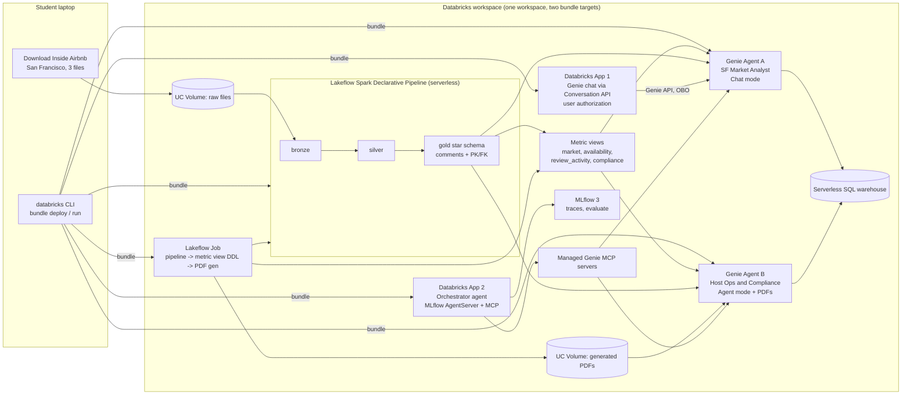

# Genie in Production: Reference Architecture and Course

## Requirements Analysis and Risk Register

| | |
|---|---|
| **Status** | Draft v0.4 (v0.1 2026-10-01; v0.2 simplified data model, San Francisco; v0.3 2026-10-02 platform changed from Free Edition to a standard workspace; v0.4 2026-10-08 agent sources split by type (D14), CI/CD in core, no fixed dates (D15)) |
| **Date** | 2026-10-08 |
| **Author** | Zoltan Toth (with Claude as research and drafting assistant) |

Everything factual in this document was checked against the Databricks documentation on 2026-10-01. Page dates are given where they matter. The five appendices in `docs/research/` hold the detailed findings with source URLs. Items marked **[verify]** could not be confirmed from documentation and are checked in the workspace when the phase that needs them starts.

---

## 1. Purpose and context

Most Genie material online stops at "create a space, ask a question". This project covers the three areas that decide whether Genie works in production: Genie Agents (curation, quality, operation), the Databricks semantic layer (Unity Catalog metric views), and productionizing Genie with Declarative Automation Bundles. It does so by building a complete, runnable reference architecture on a standard Databricks workspace (Unity Catalog, serverless compute, any cloud), and then turning that build into a Udemy or YouTube course for Databricks practitioners who are new to Genie.

The build optimizes for a working, end-to-end stack with deep coverage of Genie curation and metric views. Course polish (recordings, every click shown) is a later pass. Students need a reproducible capstone on a workspace they already have access to.

## 2. What changed since 2022 (orientation)

Many practitioners last worked hands-on with Databricks before the 2024 to 2026 wave of renames. The following renames and shifts are confirmed and matter for this project. Several of them also matter for course shelf life (see risk R-12).

| Then | Now | Notes |
|---|---|---|
| Genie Spaces | **Genie Agents** | API and SDK still use `space_id` and `/api/2.0/genie/spaces`. |
| Research Agent (Genie) | **Agent mode** | Multi-step reasoning, reports, citations. Only Agent mode reads files. |
| Databricks One | **Genie One** | Business-user chat across agents, dashboards, metric views and external sources. |
| Databricks Assistant (coding) | **Genie Code** | Also embedded in Genie Agent authoring to propose context and debug answers. |
| Databricks Asset Bundles (DABs) | **Declarative Automation Bundles** | Renamed 2026-03-16. CLI commands and YAML unchanged. Direct engine (no Terraform) is default since CLI 1.3.0. |
| Delta Live Tables | **Lakeflow Spark Declarative Pipelines** | |
| Workflows | **Lakeflow Jobs** | |
| Vector Search | **AI Search** | |
| Mosaic AI Agent Framework on Model Serving | **Custom agents on Databricks Apps** | Model Serving path is now documented as "legacy" for new agents (pages dated Sep 15, 2026). |
| Agent Bricks Knowledge Assistant and Supervisor Agent | **Closed to new customers** | Pricing page, modified 2026-09-30: "no longer available to new customers". Databricks points to Genie Agents instead. |
| Semantic layer: none | **Unity Catalog metric views** (GA April 2026) | Plus domains, Pages, certification. Together called the "Genie Ontology" human-modeled layer. |

## 3. Goals and success criteria

### 3.1 Goals

1. **G1. Genie depth.** The project explains and demonstrates how a Genie Agent produces an answer, what each curation feature does, how to measure quality with benchmarks, and how to operate an agent in production.
2. **G2. Semantic layer depth.** The project designs metric views for a real star schema, explains why Databricks recommends them under Genie, and shows the limits of the approach.
3. **G3. Production path.** One bundle deploys the whole stack to dev and prod targets in a single workspace, with a documented promotion workflow for Genie Agent configuration.
4. **G4. Serving.** At least one application outside the Genie UI consumes the agents: a Databricks App using the Genie API, and a custom orchestrator agent that routes between the two Genie Agents.
5. **G5. Course-ready artifact.** The repository, data loading steps, and notebooks are reproducible by a student in any Databricks workspace with Unity Catalog and serverless compute.

### 3.2 Success criteria for the core build

- A fresh workspace can go from zero to both Genie Agents answering benchmark questions by following the README.
- Each Genie Agent has a small benchmark set that teaches the method (Agent A: 6 questions with gold SQL, D16) and scores at least 80 percent "Good" in Chat mode; CI fails below that.
- Agent A answers availability questions only through a metric view, and no fact reaches an agent through two paths (D14).
- `databricks bundle deploy -t dev` and `-t prod` both succeed from a clean clone; prod has no user-specific paths.
- CI deploys every component: a merge to `main` deploys dev and passes the tests job, a merge to `release` deploys prod.
- A Databricks App answers questions through the Genie API using the end user's identity.
- A custom agent on Databricks Apps routes a mixed question to the right Genie Agent, with MLflow traces visible.

## 4. Scope

### 4.1 In scope (core)

| ID | Component | Description |
|---|---|---|
| C1 | Dataset | Inside Airbnb, San Francisco, one snapshot (2026-06-14), three files: detailed `listings.csv.gz`, `calendar.csv.gz`, summary `reviews.csv`. Loaded into a UC volume by the student. |
| C2 | Data engineering | One serverless Lakeflow Spark Declarative Pipeline: bronze (three raw files), silver (typed, cleansed), gold (four-table star schema with UC comments and informational PK/FK constraints). |
| C3 | Semantic layer | Metric views in gold with agent metadata (synonyms, display names, formats), deployed by a job SQL task because bundles have no metric view resource. Reduced on 2026-10-08 (D14): `availability_metrics` (calendar availability with a snowflake join to listing and host) exists; further views are added only when Agent A curation shows a need. |
| C4 | Genie Agent A: "San Francisco Market Analyst" | Chat mode. Sources: the metric views plus gold tables (D14). Full curation: joins, SQL expressions (measures, filters, fields), example SQL, entity matching, instructions, a small benchmark set (D16). |
| C5 | Genie Agent B: "Host Operations and Compliance" | Agent mode. Sources: the UC volume of 32 PDFs (ten neighbourhood market reports, twenty host house-rules sheets with synthetic rules, one short-term rental regulation summary, one data dictionary), D14. The PDFs are generated locally by `tools/generate_documents.py` and mirrored next to the CSVs, so the student copies them into a volume like the data. Demonstrates document answers next to Agent A's structured answers. |
| C6 | Serving 1: Genie chat app | Databricks App calling the Genie Conversation API with user authorization (on-behalf-of), so row filters and the per-user free allowance apply. |
| C7 | Serving 2: custom orchestrator agent | Custom agent on Databricks Apps (MLflow AgentServer, ResponsesAgent schema) consuming both Genie Agents through the managed Genie MCP servers. This is the hand-built replacement for the Supervisor Agent pattern. |
| C8 | Evaluation | Genie benchmarks for each agent (SQL correctness at the Genie layer). MLflow 3 `mlflow.genai.evaluate` with ToolCallCorrectness and Correctness scorers for the orchestrator (routing correctness). |
| C9 | Bundles and CI/CD | One bundle, direct engine, targets `dev` and `prod` in one workspace. Resources: schemas, volumes, pipeline, jobs (`setup_workspace`, `deploy_metric_views`, `tests`), two `genie_spaces`, two apps, each added as it is built (D15). GitHub Actions: PR validates, merge to `main` deploys dev and runs the tests, merge to `release` deploys prod. Promotion workflow for Genie JSON via `bundle generate genie-space`. |
| C10 | Documentation | README, architecture diagram, per-module notes, this document and its appendices. |

### 4.1.1 Design principle: the smallest data model that still teaches

Three input files and four core gold tables (plus the listing-grain `fact_listing_activity`) is the floor, not a convenience. Each table earns its place by exercising something a Genie or metric view student must see:

| Need | Why a single wide table would not do |
|---|---|
| A real fact table at a fine grain (`fact_calendar`, one row per listing per night) | Metric views only make sense when aggregation is deferred to query time; `MEASURE()` over a pre-aggregated listings table teaches nothing. |
| At least one join (`fact_calendar` to `dim_listing`) | Genie join specs, metric view `joins`, UC foreign keys, and the "why Genie gets joins wrong" lesson all need two tables. |
| A second-level dimension (`dim_host`, derived from listing columns) | Snowflake joins in metric views (`calendar -> listing -> host`), the multi-listing host questions Agent B exists for, and a clean one-to-many story. It costs nothing because it comes from the same file. |
| A second fact at a different grain (`fact_review`, one row per review) | Window measures (trailing twelve months, quarter over quarter), and a second domain so the two agents are genuinely different. |

Cut from the earlier draft: four quarterly snapshots and SCD Type 2 (now stretch S6), `dim_neighbourhood` and the geojson, `dim_date`, and `fact_listing_snapshot`. None of them served the three pillars directly.

### 4.2 Stretch (only once core is done)

| ID | Component | Why stretch |
|---|---|---|
| S1 | Same orchestrator deployed to Model Serving with `agents.deploy` and resource passthrough | Documented as legacy, but still what many clients run and what the certifications covered. Also exercises `DatabricksGenieSpace` resources and the `run_as` restriction. |
| S2 | GitHub Actions: PR validates, merge to `main` deploys dev and runs integration tests, merge to `release` deploys prod | Moved into core on 2026-10-08, kept minimal for teaching. Signs in as the prod service principal from GitHub environments `ci` and `prod`: OAuth client secret now, workload identity federation once an account admin creates the policies (R-17). As built: `.dev/cicd.md`. |
| S3 | Materialize one metric view | Each materialized metric view owns its own pipeline; worth showing once the SQL-task path works. |
| S4 | Second city (Budapest or Amsterdam) with a `city` dimension | Multi-city metric views; a second currency motivates a parameterized metric view. |
| S6 | Quarterly snapshots with SCD Type 2 on `dim_listing` | Teaches AUTO CDC and a time dimension on listings. Cut from core because it adds files and tables without serving the Genie or metric view objectives. |
| S5 | Genie One walkthrough and certification/domains in UC | Explains how metric views and agents surface to business users. |

### 4.3 Explicitly out of scope

- **Agent Bricks Supervisor Agent and Knowledge Assistant.** Closed to new customers as of 2026-09-30. Covered as a short lecture ("what it was, why Databricks now points to Genie Agents") and nothing more.
- **Multi-workspace promotion.** The build keeps dev and prod as two bundle targets in one workspace so the setup stays small. Documented as an alternative design, with a second workspace as a possible optional module later (D12).
- **ML models as tools.** No price prediction model. Could be added later as a UC function tool.
- **Streaming ingestion.** The pipeline is batch over files in a volume.
- **The 47 MB detailed reviews file.** Free-text reviews are not needed for the review velocity metrics. The 9 MB summary reviews file (listing id and date) is enough for review velocity metrics.
- **Neighbourhood files and geojson.** The neighbourhood comes from the `neighbourhood_cleansed` column in listings. Maps are not a teaching objective.
- **Course recording.** Not part of the build. Only the build and the structure.

## 5. Stakeholders and audience

| Stakeholder | Interest |
|---|---|
| Author | A complete, demonstrable reference repo with production-grade depth on Genie and metric views. |
| Students (Databricks practitioners new to Genie) | Reproducible on any Databricks workspace with Unity Catalog and serverless compute; explains the why behind each curation choice; no specific cloud required. |
| Inside Airbnb | Data provider; CC BY 4.0 with community guidelines asking not to republish raw data and that instructors consider contributing. |

## 6. Constraints

### 6.1 Platform: a standard Databricks workspace

The v0.2 draft targeted Databricks Free Edition. On 2026-10-02 the build moved to a standard workspace because Free Edition has no on-demand clusters, which developing the streaming tables in Lakeflow Spark Declarative Pipelines needs (decision D1). The author builds on an Azure Databricks workspace; nothing in the design depends on the cloud provider, and the only cloud-specific value in the repo is the `workspace.host` in `databricks.yml`.

| Constraint | Consequence for this design |
|---|---|
| Unity Catalog and serverless compute available | Pipeline is `serverless: true`; the warehouse and the apps are serverless. Keep data small so a full rebuild stays short. |
| One workspace, two bundle targets | `dev` and `prod` share the workspace and the catalog; they are separated by schema name, `mode`, and `run_as`. Pipelines for both targets can run at the same time, but the course never needs them to. |
| One SQL warehouse shared by both targets | Both Genie Agents, dashboards and the apps use one `warehouse_id` through a single bundle lookup variable. A 2X-Small is enough for the benchmark set (NFR-3). |
| Workspace admin rights needed once | To toggle workspace-level previews (Genie files in volumes) and to create the service principal that `prod` runs as. Account-level settings (partner-powered AI, cross-geo) may need an account admin **[verify]**. |
| Outbound internet from serverless notebooks may be restricted by workspace network policy | Students download the Inside Airbnb files locally and upload them to a volume. The setup notebook reads the public S3 mirror, which is reachable over s3a. |
| Genie usage is metered per user | See 6.2 for the free allowance and the service principal billing rule that drives D7. |

### 6.2 Genie-specific constraints (docs dated Sep 11 to Sep 30, 2026)

- Up to 50 tables, views or metric views per agent; best practice says five or fewer. Our agents will use three to six sources each.
- 100 instructions and 200 knowledge store snippets per agent. One General instructions block.
- The 2026 listings file has no `house_rules` column (Inside Airbnb dropped it). The twenty house-rules PDFs therefore carry synthetic rules, seeded by `host_id` so re-runs are stable, and each sheet says so; every count and registration figure on them is real.
- Only Agent mode can read files in volumes. The feature is Beta behind a workspace admin toggle. Without content search: 500 files per volume, 10 MB per file, five files retrieved per question. Content search needs Lakebase and region-specific AI functions.
- Two credentials: SQL runs with the embedded compute credentials of the last author who saved the warehouse; data access is evaluated as the end user.
- Genie Agents deployed by bundles are not bindable. A recreate produces a new `space_id` and loses conversation history.
- Genie JSON table identifiers are fully qualified literals. Per-target catalog or schema names need per-target JSON files or a tokenizing step.
- Genie One and Genie Agents are free for named users until 2027-01-31. After that, 150 DBUs per user per month free, then 0.070 USD per DBU. Service principal usage is billed with no free allowance.

### 6.3 Time

No fixed end date (D15, 2026-10-08). The phase order is in `.dev/plan.md` section 4.

## 7. Target architecture



### 7.1 Data model (gold)

| Table | Grain | Source | Notes |
|---|---|---|---|
| `dim_listing` | one row per listing | `listings.csv.gz` | 7,332 rows. Neighbourhood, room and property type, `is_hotel`, accommodates, amenities array, `nightly_price` (parsed from `$1,234.00` text, null for 19 percent), `minimum_nights`, `stay_type`, review scores, `license`, derived `license_status`. Primary key `listing_id`, foreign key `host_id`. |
| `dim_host` | one row per host | derived from `listings.csv.gz` host columns | 3,499 rows. Superhost flag, identity verified, `host_tenure_years` (the 2026 export has no `host_since`, response rate or acceptance rate), portfolio size and size band. Primary key `host_id`. |
| `fact_calendar` | one row per listing per night, 2026-06-14 to 2027-06-21 | `calendar.csv.gz` | About 2.68 million rows after dropping 90 orphan listings. `is_available`, minimum and maximum nights. **No price column in the 2026 export.** Foreign key `listing_id`. |
| `fact_review` | one row per review | summary `reviews.csv` | 434,102 rows after dropping 4,197 orphan rows; same-day repeats are kept (they are distinct reviews). `listing_id` and `review_date` only. Foreign key `listing_id`. |
| `fact_listing_activity` | one row per listing as of the snapshot | computed from `fact_review`, `fact_calendar` and `dim_listing` | 7,332 rows. Reviews in the trailing 365 days, estimated nights and revenue (Inside Airbnb occupancy model, reproduced to 99.9 percent), open nights next 90 and 365. The one table where the three source files meet; the source of `market_metrics` and `compliance_metrics`. Primary key `listing_id`. |

Full column lists, silver rules and the derivation of `fact_listing_activity`: [02-architecture.md, section 1](02-architecture.md#1-data-pipeline).

Every gold table gets column comments and informational primary and foreign key constraints, because Genie imports both. This is a deliberate teaching point: curation starts in Unity Catalog, not in the Genie UI.

### 7.2 Metric views

| Metric view | Source and joins | Measures (examples) | Teaches |
|---|---|---|---|
| `market_metrics` | `fact_listing_activity` joined to `dim_listing`, nested join to `dim_host` | listings, active listings, median and average nightly price, estimated booked nights and revenue (occupancy model), average daily rate and occupancy rate as composed measures, superhost share, average rating | Snowflake joins, composed measures via MEASURE(), FILTER measures, formats, synonyms, `rely` |
| `availability_metrics` | `fact_calendar` joined to `dim_listing` and `dim_host` | open nights, blocked nights, open share, listings with any open night, average minimum stay, by calendar month | A second grain over the same dimensions; stating a forward-looking window in the view comment |
| `review_activity_metrics` | `fact_review` joined to `dim_listing` and `dim_host` | reviews, reviewed listings, reviews per listing, trailing twelve month reviews, previous quarter, quarter over quarter change | Window measures with `trailing`, `offset` and `semiadditive`; date hierarchy on the order field |
| `compliance_metrics` | same source and joins as `market_metrics` | short-term listings, registered listings, unregistered short-term listings, registration rate, entire homes over the 90-night cap, over-cap homes without a certificate, estimated revenue of unregistered listings | One view per KPI group on a shared source; FILTER measures that encode the ordinance |
| `market_metrics_eur` (optional) | `market_metrics` as source | the money measures converted by an `eur_rate` parameter | Composability and parameters; shows that parameters block materialization |

Revenue is no longer derived from the calendar: the 2026 export has no calendar price, and a blocked night is not a booking. YAML for each view: [02-architecture.md, section 3](02-architecture.md#3-metric-view-definitions). Names follow the `<subject>_metrics` convention (changed 2026-10-05 from `mv_*`).

Built so far (D14): `availability_metrics` only; the other views are the design for when Agent A needs them.

Deployment (D5): one `.sql` file per view in `bundle/src/metric_views/`, run by a `sql_task` in the `deploy_metric_views` job. The file sets `USE CATALOG` / `USE SCHEMA` from the `catalog` and `schema` job parameters, and the YAML uses bare table names.

### 7.3 Genie Agents

**Agent A, San Francisco Market Analyst (Chat mode).** Sources (D14): `availability_metrics`, `dim_listing` (its own availability columns hidden) and `dim_host`; no fact is reachable through two paths. Curation plan, in the order Databricks recommends: UC comments and constraints first, then metric view metadata, then column configs and entity matching on `neighbourhood` and `room_type`, then example SQL, and only last a short General instructions block ("listings" excludes hotels, "occupancy" means the published estimate). A small benchmark set with gold SQL (6 questions, D16), scored after each curation step and by CI on every merge to `main`.

**Agent B, Host Operations and Compliance (Agent mode).** Sources (D14): the `documents` volume (32 PDFs) only. Questions about house rules, the regulation, the neighbourhood reports and the data dictionary; one benchmark per document, judged by the LLM judge with evaluation notes. Questions that need numbers and documents go through the orchestrator. Details: [02-architecture.md, section 2](02-architecture.md#2-what-each-genie-agent-sees).

### 7.4 Serving

**App 1, Genie chat.** Streamlit or the official `appkit-genie` template. User authorization with `user_api_scopes: [genie, sql]`, so queries run as the end user, row filters apply, and usage counts against the user's free allowance rather than a billed service principal.

**App 2, orchestrator agent.** Routing rules, identity, tracing and evaluation design: [02-architecture.md, section 4](02-architecture.md#4-orchestrating-the-two-agents). From the official `agent-openai-agents-sdk-multiagent` template. Each Genie Agent is attached as an MCP server at `/api/2.0/mcp/genie/{space_id}`. The orchestrator decides which agent answers, can call both, and merges. MLflow autologging produces traces. This is the pattern that replaces the Supervisor Agent for new customers.

### 7.5 Bundle layout

As built on 2026-10-08, with the planned additions marked:

```
.github/workflows/               # pr.yml, main.yml, release.yml
bundle/
  databricks.yml                 # bundle, variables, targets dev/prod
  scripts.yml, scripts/          # one-time admin scripts (prod managers group)
  resources/
    schemas.yml                  # raw and airbnb schemas, files and documents volumes
    airbnb_pipeline.yml          # serverless SDP pipeline
    setup_workspace.job.yml      # copies source files into the volumes
    metric_views.job.yml         # one sql_task per metric view
    tests.job.yml                # SQL assertions on gold and metric views
    (planned) genie_market.yml, genie_host_ops.yml, app_genie_chat.yml, app_orchestrator.yml
  src/
    pipeline/                    # bronze, silver, gold SQL
    metric_views/                # one .sql file per view
    tests/                       # assertion SQL
    setup/                       # setup notebook
    (planned) genie/*.geniespace.json, apps/genie_chat/, apps/orchestrator/
  (planned) eval/                # benchmarks_market.json, benchmarks_host_ops.json, evaluate_orchestrator.py
tools/
  generate_documents.py          # local PDF generation; output mirrored to S3 beside the CSVs
```

Promotion workflow for Genie configuration: curate in the dev agent UI, run `databricks bundle generate genie-space --resource <key> --force`, review the JSON diff in a pull request, merge to `main` (CI deploys dev), merge to `release` (CI deploys prod), run benchmarks against prod. Prod agents are deployed once and then only updated, never recreated, to keep their `space_id`.

No bundle-level `run_as`: it is forbidden when a model serving endpoint is in the bundle (relevant for S1). The `prod` target sets `run_as` to the service principal, and CI deploys prod as that same service principal, so it also owns every prod object; `dev` runs as the deploying identity.

## 8. Functional requirements

| ID | Requirement | Priority |
|---|---|---|
| FR-1 | A student can load the three San Francisco files into a UC volume with the documented upload path (Catalog Explorer or `databricks fs cp`) in under 15 minutes. | Must |
| FR-2 | The pipeline builds bronze, silver and gold from the volume with one `bundle run`, and is idempotent. | Must |
| FR-3 | Gold tables carry column comments and informational PK/FK constraints that Genie imports. | Must |
| FR-4 | Metric views are created by a bundle-deployed SQL task and are parameterized by target catalog and schema. | Must |
| FR-5 | Agent A scores at least 80 percent on its benchmark questions in Chat mode, the run is repeatable, and CI fails below the threshold. | Must |
| FR-6 | Agent B answers mixed table-plus-PDF questions in Agent mode with page-level citations. | Must, degrade to Should if the volumes preview cannot be enabled in the workspace |
| FR-7 | Both agents are defined as `genie_spaces` resources and deploy to dev and prod targets with correct fully qualified table names per target. | Must |
| FR-8 | App 1 lets a signed-in user chat with Agent A through the Genie API using their own identity. | Must |
| FR-9 | App 2 routes questions between both agents via MCP and records MLflow traces. | Must |
| FR-10 | An MLflow evaluation run scores App 2's routing on a small labeled set. | Should |
| FR-11 | `mode: development` prefixes dev resources and pauses schedules; `mode: production` validates non-user paths. | Must |
| FR-12 | The README reproduces the whole stack from a clean clone in a fresh workspace. | Must |
| FR-13 | The 32 PDFs (market reports for the top ten neighbourhoods, house rules for the top twenty hosts, one regulation summary, one data dictionary) are generated locally from the snapshot by `tools/generate_documents.py`, mirrored to `s3://dbx-data-public/airbnb-sf/documents/`, and copied into a dedicated managed volume by the setup step; each under 10 MB, fewer than 500 files. Done 2026-10-02. | Must |
| FR-14 | Cost and usage of Genie is visible through the Monitor tab and the GENIE_FREE_USAGE and Serverless Real-Time Inference SKUs in system tables. | Should |

## 9. Non-functional requirements

| ID | Requirement |
|---|---|
| NFR-1 | The pipeline, the warehouse and the apps run on serverless compute. Nothing on the core path depends on the cloud provider. |
| NFR-2 | A full rebuild (pipeline plus metric views) completes in under 20 minutes; PDFs are static inputs, not rebuilt. |
| NFR-3 | Genie Chat-mode answers on the metric views return in under 30 seconds on a 2X-Small warehouse for the benchmark set. |
| NFR-4 | All configuration is in git. No manual UI step is required for prod except the one-time workspace preview toggles. |
| NFR-5 | Python dependencies are pinned (databricks-ai-bridge, databricks-openai or databricks-langchain, mlflow, databricks-sdk) because these packages moved fast in 2026. |
| NFR-6 | Each module's notes state the doc page and date the behavior was verified against, so the course can be re-verified quickly when Databricks changes names again. |
| NFR-7 | Inside Airbnb attribution appears in the README, the PDFs and the course. |

## 10. Decisions taken and decisions open

### 10.1 Taken

| ID | Decision | Rationale |
|---|---|---|
| D1 | A standard Databricks workspace (Unity Catalog, serverless compute, any cloud) is the primary environment, with `dev` and `prod` as two bundle targets in that one workspace. Revised 2026-10-02; v0.2 had chosen Free Edition. | Free Edition has no on-demand clusters, which developing the streaming tables in Lakeflow Spark Declarative Pipelines needs. Students build in whatever workspace they have; nothing in the design depends on the cloud provider. |
| D2 | San Francisco is the primary city (replacing the research appendix's Budapest recommendation); a second city is stretch. | Verified 2026-10-01, corrected 2026-10-05: 7,332 listings (7,422 is the calendar's listing count), USD prices, three free snapshots (2025-12-04, 2026-03-16, 2026-06-14), listings 3.8 MB, calendar 6.1 MB (about 2.7 million rows), summary reviews 9 MB. Smaller than Budapest, no currency conversion, a `license` field with 63 percent licensed listings for a compliance metric, and well-documented short-term rental rules (under 30 nights) for the regulation PDF. |
| D3 | Supervisor Agent is out of scope; the orchestrator is hand-built on Databricks Apps with MCP. | Closed to new customers 2026-09-30; Apps is the documented default for new custom agents. |
| D5 | Metric views are deployed by a job SQL task, not a bundle resource. | No bundle or Terraform resource exists as of 2026-09-17, and a Lakeflow Spark Declarative Pipeline rejects `CREATE VIEW ... WITH METRICS` (it accepts only materialized views, streaming tables, `APPLY CHANGES INTO` and `SET`). Each view is one `.sql` file run by a `sql_task` in the `deploy_metric_views` job, with `catalog` and `schema` job parameters: `USE CATALOG IDENTIFIER({{catalog}}); USE SCHEMA IDENTIFIER({{schema}});` followed by a plain `CREATE OR REPLACE VIEW ... WITH METRICS LANGUAGE YAML` whose `source` and join tables are bare table names. Verified on 2026-10-07: the stored YAML keeps the bare names and they resolve against the view's own schema, not the caller's (queried from a `samples.tpch` session), and UC lineage lists the three gold tables. The YAML reference (last updated 2026-09-17) shows three-part names, so bare names are tested behaviour rather than documented behaviour; the fallback is the `EXECUTE IMMEDIATE` with `replace()` pattern from the Databricks Community blog "How to Deploy Metric Views with DABs" (2025-11-13). |
| D6 | Genie Agent config lives in git as `.geniespace.json`, generated from the dev UI. | Only supported round trip; UI edits do not flow back automatically. |
| D7 | Apps use user authorization, not the app service principal, for Genie calls. | Row filters apply, and service principal Genie usage is billed with no free allowance. |
| D8 | Model Serving deployment is stretch, taught as "legacy but common". | Docs call it legacy for new agents; many clients still run it. |
| D13 | Each bundle target owns its own schemas, and every resource refers to a schema through `${resources.schemas.<key>.name}`, never through the bare variable. | Decided 2026-10-05. `mode: development` prefixes schema names with `dev_<user>_` (dev publishes to `genie_reference.dev_<user>_airbnb`, prod to `genie_reference.airbnb`), so isolation is automatic. The earlier assumption that schemas are not prefixed was wrong; a variable-based path such as the pipeline's `source_path` must be built from the resource name or dev reads prod's schema. |
| D14 | Agent A answers from the metric views and gold tables; Agent B answers from the documents. Metric views are reduced to what exists (`availability_metrics`) and grow only when Agent A curation shows a need. | Decided 2026-10-08. Splits the two agents by source type (structured versus documents), which the orchestrator then routes between, and keeps the semantic layer from growing ahead of a proven need. Supersedes the two-view minimum in FR-4. |
| D15 | Each component goes into the bundle and through CI as soon as it is built; the plan has no fixed dates. | Decided 2026-10-08. Ownership, privilege and naming problems only appear when CI deploys a component (two such problems appeared on the first prod release), so they are found per component rather than in a final bundling phase. Build phases and their order are in `.dev/plan.md` section 4. |
| D16 | Agent A keeps a small benchmark set (6 questions) instead of 20 or more. | Decided 2026-10-08. Six questions are enough to teach benchmarks, scoring, the CI gate and curation; more questions add authoring time without a new lesson. Trade-off: one wrong answer moves the score by 17 points, so the 80 percent gate tolerates one failure and is sensitive to Genie's run-to-run variation. |

### 10.2 Open

| ID | Question | Options |
|---|---|---|
| D4 | Deploy both apps to both targets, or only to prod? The Free Edition three-app quota that forced this question is gone; what remains is cost and clutter. | (a) Apps only in prod, dev tests locally with `databricks apps run-local`; (b) both apps in both targets; (c) one combined app with two pages. Leaning (a). |
| D9 | Should Agent A also run in Agent mode for comparison, or stay Chat-only to keep the contrast clean? | Chat-only is cleaner for teaching verified answers. |
| D10 | Benchmarks as a CI gate: is there an API to trigger a benchmark run and read scores? Not found in docs **[verify]**. | If not, build a small harness over the Conversation API comparing result sets to gold SQL, logged to MLflow. |
| D11 | Where do measure definitions live when both metric views and Genie SQL expressions can hold them? | Proposed rule: anything reusable across tools goes in the metric view; Genie-only phrasing and filters go in SQL expressions. To be validated during the Genie Agents phase. |
| D12 | Should the course show a second workspace as an optional cross-workspace promotion module? | Depends on access to a second workspace. |


## 11. Build phases

No fixed dates (D15, 2026-10-08). The phases, their order, state and exit criteria are kept in one place: `.dev/plan.md` section 4. The original two-week schedule (2026-10-02 to 2026-10-15) is in this file's git history.

## 12. Risk register

Likelihood and impact on a 1 to 3 scale. Score is their product.

| ID | Risk | L | I | Score | Mitigation | Trigger / owner |
|---|---|---|---|---|---|---|
| R-1 | "Analyze files in volumes" (Beta) is unavailable or not toggleable in the workspace, breaking Agent B's PDF story. | 2 | 3 | 6 | Check before phase 6 (Agent B). Fallback: PDF upload into a conversation (Beta, UI only), or move PDF content into a `documents` table via `ai_parse_document` and keep Agent B structured-only. | Before phase 6; author |
| R-2 | Genie Agents or Agent mode depend on an account-level setting (partner-powered AI, cross-geo) that is off and needs an account admin. | 1 | 3 | 3 | Check before phase 5; request the toggle early. Fallback: Chat mode only for both agents. | Before phase 5 |
| R-3 | Serverless cost creeps during curation: repeated full refreshes of the 2.7 million row calendar table and long warehouse sessions. | 2 | 1 | 2 | Load data once; keep calendar at one snapshot; prefer selective refresh; set a budget alert on the workspace. | Monthly usage review |
| R-4 | Dev and prod share one catalog; a deploy with the wrong `-t` writes into the other target's schema. | 2 | 2 | 4 | `mode: development` prefixes dev resources; schema name comes from the target; `prod` is never the default target. | Unexpected tables in a schema |
| R-5 | Genie `space_id` changes on redeploy, breaking App resources and losing history. | 2 | 3 | 6 | Deploy prod agents once; reference `${resources.genie_spaces.X.space_id}` in app resources so apps follow; never change key or `parent_path`. | Any prod recreate |
| R-6 | Genie JSON needs per-target fully qualified names; hand-maintaining two JSON files drifts. | 3 | 2 | 6 | Inline `serialized_space` in the resource YAML with `${var.catalog}.${resources.schemas.schema.name}` table names (tested 2026-10-08: substitution does not run inside a `file_path` JSON, but does on the inline string, for all three copies). A pull script turns `generate` output back into this form. | JSON diff shows catalog names |
| R-7 | Two apps times two targets is four running apps to keep alive, pay for and explain. | 2 | 1 | 2 | Decision D4; default to prod-only apps with local dev runs. | Before phase 7 |
| R-8 | Managed MCP servers for Genie are Public Preview and may change or not be enabled. | 2 | 2 | 4 | Fallback: `GenieAgent` from `databricks-langchain` calling the Conversation API directly. | Before phase 8 |
| R-9 | Model Serving endpoint quota or permissions in the workspace block S1. | 1 | 1 | 1 | Stretch only. | Before S1 |
| R-10 | Benchmarks cannot be run from the API, weakening the CI gate story. | 2 | 2 | 4 | Build a small Conversation API harness with gold SQL comparison logged to MLflow (D10). | Phase 9 |
| R-11 | 2X-Small warehouse makes Genie answers slow (tens of seconds), hurting recordings. | 2 | 2 | 4 | Pre-warm the warehouse; keep facts small; cut to results in editing. | Benchmark timings |
| R-12 | Platform churn invalidates course content: renames in 2026 alone touched Genie, bundles, pipelines, agents; Supervisor Agent closed within eight months of GA; Genie pricing changes on 2027-02-01. | 3 | 2 | 6 | Teach concepts over screens; record the UI last; keep a "verified against docs dated X" note per module; plan a re-verification pass before publishing. | Any release note |
| R-13 | Data policy: Inside Airbnb asks not to republish raw data. | 2 | 2 | 4 | Students download data themselves; redistribute only derived artifacts; attribute and consider donating. | Before any publishing |
| R-14 | Outbound internet restrictions block downloads or `pip install` in notebooks. | 2 | 2 | 4 | Students download locally and upload; pin packages via app `requirements.txt`. The setup job reads the S3 mirror over `s3a://`, which needs `SELECT ON ANY FILE` for a non-admin identity (granted to the service principal on 2026-10-08); HTTPS download would remove that grant. | Setup job failures |
| R-15 | Unfamiliar or newly renamed surfaces slow the build. | 2 | 2 | 4 | Phases with exit criteria; stretch items pre-cut; use the official templates rather than writing apps from scratch. | Any phase taking much longer than planned |
| R-16 | Fast-moving Python packages (databricks-ai-bridge 0.22, databricks-openai 0.17, mlflow 3.16 as of Oct 2026) break templates. | 2 | 2 | 4 | Pin versions in `pyproject.toml`; follow the template pins. | Import errors |
| R-17 | No account-level access to configure OIDC federation for CI (S2). Occurred 2026-10-08: the author is a workspace admin but not an account admin. | 2 | 1 | 2 | OAuth M2M with a client secret for the workspace service principal, stored as GitHub environment secrets; switch to federation once an account admin creates the policies. | Occurred |
| R-18 | The `price` column is exported as text with a dollar sign and thousands separators; the 2026 calendar export has no price column at all. | 3 | 1 | 3 | Parse to `nightly_price` in silver (null for 19 percent); revenue comes from the occupancy model on `fact_listing_activity`, never from the calendar; benchmark a price question early. | Benchmark failures on price |

## 13. Open questions where practice matters more than documentation

The documentation does not settle these. The build should produce an opinion on each, and the course should state it.

1. **Promotion in practice.** Given that bundle-deployed Genie Agents are not bindable and recreate on key changes, what is the workable way to promote agent configuration between environments or workspaces: generate-and-deploy, management API scripts, or clone in the UI?
2. **Measure placement.** Where should measure logic live: metric views, Genie SQL expressions, or both? Is there a rule that holds up?
3. **Chat mode versus Agent mode in production.** Should Agent mode be exposed to business users, or is Chat mode with verified answers the safer production default?
4. **Table count.** Databricks says five or fewer sources. How should domains be split across agents when the data model is larger?
5. **Benchmarks.** How many benchmarks are enough before go-live, and should they run on a schedule? Is there an API, or does it take a script over the Conversation API?
6. **Identity.** Service principal versus on-behalf-of in apps: which to pick and why, now that service principal Genie usage is billed with no free allowance?
7. **Genie One.** Does Genie One change how individual agents should be curated?
8. **Files in volumes.** Quality and limits of the Beta, and whether content search is worth the Lakebase dependency.
9. **Supervisor Agent closure.** Does the Apps-plus-MCP orchestrator cover what Supervisor Agent users relied on?
10. **What is missing** from this architecture for a production deployment?

## 14. Assumptions

- Course language is English.
- The builder has workspace admin rights and can toggle workspace-level previews.
- Students are comfortable with SQL, Python basics, Unity Catalog, and the Databricks CLI.
- The San Francisco 2026-06-14 snapshot will stay freely downloadable for about twelve months; the course names the exact snapshot and explains how to substitute a newer one.

## 15. Glossary of acronyms used

- **UC**: Unity Catalog. **SDP**: Spark Declarative Pipelines (Lakeflow). **DBU**: Databricks Unit. **OBO**: on-behalf-of user authorization. **MCP**: Model Context Protocol. **SCD**: slowly changing dimension. **PK/FK**: primary and foreign key informational constraints. **ADR**: average daily rate.

## Appendices

Detailed, source-cited research notes, compiled 2026-10-01. The dataset appendix recommends Budapest; decision D2 overrides it with San Francisco, verified against the same sources.

- [Genie Agents](research/genie-agents.md)
- [Unity Catalog metric views](research/metric-views.md)
- [Declarative Automation Bundles](research/bundles.md)
- [Serving options, MCP, evaluation](research/agent-framework.md)
- [Inside Airbnb dataset](research/dataset.md)
