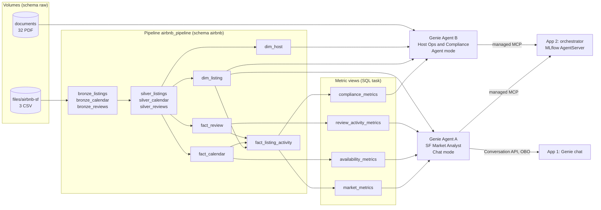

# Architecture: pipeline, metric layer, Genie Agents, orchestration

Design document for the capstone. It replaces sections 7.1 to 7.4 of [01-requirements-and-risks.md](01-requirements-and-risks.md) and is the specification the pipeline, metric views, Genie Agents and apps are built from. Data facts come from the local profile of the 2026-06-14 San Francisco snapshot (profiled 2026-10-05); platform facts from the Databricks docs pages listed at the end (checked 2026-10-05).

Contents:

1. [Data pipeline](#1-data-pipeline) (volumes, bronze, silver, gold, PDFs)
2. [What each Genie Agent sees](#2-what-each-genie-agent-sees)
3. [Metric view definitions](#3-metric-view-definitions)
4. [Orchestrating the two agents](#4-orchestrating-the-two-agents)
5. [Facts the design rests on](#5-facts-the-design-rests-on)

## 0. The picture in one paragraph

Three CSV files and 32 PDFs land in two Unity Catalog volumes. A serverless Lakeflow Spark Declarative Pipeline turns the CSVs into three bronze streaming tables, three typed silver tables, and a five-table gold layer: two dimensions, two event facts, and one listing-grain activity fact that combines reviews, calendar and listing attributes. Four metric views sit on gold and own every business definition. Two Genie Agents consume them: a Chat-mode market analyst and an Agent-mode host-operations agent that also reads the PDFs. An orchestrator app on Databricks Apps routes questions between the two agents through their managed MCP servers.



## 1. Data pipeline

### 1.1 Volumes and schemas

| Object | Purpose | Created by |
|---|---|---|
| `genie_reference.raw.files` (managed volume) | `airbnb-sf/listings.csv`, `calendar.csv`, `reviews.csv` | Bundle volume resource; `setup_workspace` job copies from the public mirror, or students upload by hand |
| `genie_reference.raw.documents` (managed volume) | The 32 PDFs, flat, no subfolder | Bundle volume resource; `setup_workspace` job copies from the mirror's `documents/` |
| `genie_reference.airbnb` (schema) | Bronze, silver, gold tables and the metric views | Bundle schema resource; the pipeline publishes here |

In the dev target the two schemas are `dev_<user>_raw` and `dev_<user>_airbnb`; the volume names are unchanged inside them.

One schema for all layers keeps the course simple. Layer is carried by the table prefix and a `quality` table property, so Genie sources can be filtered by name and the student sees the medallion in one listing. Dev and prod share the catalog under different bundle targets. `mode: development` prefixes schema names with `dev_<user>_` (and job and pipeline names with `[dev <user>]`), so dev publishes to `genie_reference.dev_<user>_airbnb` and reads from `genie_reference.dev_<user>_raw`, while prod uses `airbnb` and `raw`. Decision D13 (2026-10-05): every resource refers to a schema through `${resources.schemas.<key>.name}`, including the pipeline's `source_path`, so the prefix propagates. The two volumes are bundle resources inside the per-target raw schema; the setup job fills them from the mirror, so nothing is uploaded twice by hand.

### 1.2 Bronze: raw, all strings, append-only

Written in `bundle/src/pipeline/` as three SQL files. Three streaming tables fed by Auto Loader (`read_files` with `inferColumnTypes => false`, a rescued-data column and `schemaEvolutionMode => 'addNewColumns'`), each with ingestion metadata (`_source_file`, `_source_modified_at`, `_ingested_at`) and two warning expectations (id present, no rescued data). The volume path arrives as `${source_path}` from the pipeline's `configuration` block, the stable mechanism; the Beta `parameters` block with `:name` syntax is not used.

Pipeline source files are plain SQL, not notebooks: pipeline source does not execute notebook magics such as `%run`, and shared values travel through pipeline configuration (or Python module imports) instead. Silver needs no configuration at all, since it only reads bronze.

| Table | Rows | Notes |
|---|---|---|
| `bronze_listings` | 7,332 | 90 string columns; `multiLine` on because descriptions contain newlines |
| `bronze_calendar` | 2,709,030 | 5 columns, no price in the 2026 export |
| `bronze_reviews` | 438,299 | 2 columns: `listing_id`, `date` |

Bronze is not a Genie source.

### 1.3 Silver: typed, deduplicated, conformed

Materialized views (full recompute is cheap at this size and keeps the SQL readable). Each silver table does only three things: cast, clean, and enforce referential integrity. Orphan rows are removed with a semi join on `silver_listings` rather than an expectation, because an expectation can only test columns of the row itself; the drop is verified by comparing bronze and silver row counts. Expectations are used for what they can test: a dropped row when a key or date fails to cast, a logged warning for a null host, neighbourhood or a non-positive price.

**`silver_listings`** (7,332 rows, one per listing)

- Keep one row per `id`: the file has two scrape dates (2026-06-14 and 2026-06-22); keep the latest `last_scraped` per id.
- Drop the 13 columns that are entirely null in this export (`host_since`, `host_response_time`, `host_response_rate`, `host_acceptance_rate`, `host_thumbnail_url`, `host_neighbourhood`, `host_total_listings_count`, `host_verifications`, `neighbourhood`, `neighbourhood_group_cleansed`, `calendar_updated`, `instant_bookable`, `neighborhood_overview`) and the URL and raw-quote columns the agents never need (`picture_url`, `host_picture_url`, `host_profile_url`, `host_url`, `price_quote_raw`, `scrape_id`).
- Cast: `price` from `$1,234.00` text to `DECIMAL(10,2)` (null for 19.1 percent of rows); `t`/`f` columns to boolean; dates to `DATE`; counts to `INT`; scores to `DECIMAL(3,2)`; `amenities` from JSON text to `ARRAY<STRING>` with `from_json`.
- Derive `license_status` from the free-text `license` column, using the same rules the regulation PDF documents: `certificate` when it matches `STR-\d+`, `pending` when it matches `\d{4}-\d+STR`, `exempt` when it contains "exempt" or "not needed", `missing` when null, otherwise `other`.
- Derive `stay_type`: `short_term` when `minimum_nights < 30`, else `long_term` (30 nights or more is outside the short-term rental ordinance; 40.2 percent of listings).
- Derive `is_hotel`: `room_type = 'Hotel room'` or `property_type` contains "hotel". Hotels are 16 percent of listings and skew Downtown; the agents need a clean way to exclude them.
- Keep Inside Airbnb's published estimates as `published_occupancy_l365d` and `published_revenue_l365d`. They are the gold answers that validate `fact_listing_activity`.

**`silver_calendar`** (about 2.68 million rows)

- Cast `date` to `DATE`, `available` to boolean `is_available`, nights to `INT`.
- Semi join on `silver_listings`: 90 listing ids (32,850 rows) are not in `listings.csv` and are dropped. Latest ingested row per listing and night wins, so a newer calendar snapshot replaces the old one.

**`silver_reviews`** (434,102 rows)

- Cast `date` to `DATE` as `review_date`.
- Semi join on `silver_listings`: 4,197 rows belong to listings not in `listings.csv` and are dropped. No dedupe, because the summary file has no review id; a new reviews snapshot replaces the file and needs a full refresh of `bronze_reviews`.
- Keep the 8,790 rows that repeat a `(listing_id, date)` pair. The summary file has one row per review, so two rows on one day are two guests, not a duplicate. After the orphan drop the count matches the sum of `number_of_reviews` in `listings.csv` exactly (434,102), which is the test that proves it.

### 1.4 Gold: a star schema plus one activity fact

Materialized views with a table comment, a column comment on every column, and informational `PRIMARY KEY` and `FOREIGN KEY ... RELY` constraints. Genie imports comments and constraints; this is where curation starts.

| Table | Grain | Rows | Keys | What it carries |
|---|---|---|---|---|
| `dim_host` | one row per host | 3,499 | PK `host_id` | `host_name`, `is_superhost`, `identity_verified`, `has_profile_pic`, `host_location`, `host_about`, `host_tenure_years` (from `hosts_time_as_host_years` + months/12, because `host_since` is empty in this export), `platform_listings_count` (Airbnb-wide), `sf_listings_count` (count in this snapshot), `host_size_band` (`1`, `2-4`, `5-19`, `20+`) |
| `dim_listing` | one row per listing | 7,332 | PK `listing_id`, FK `host_id` | name, description, `neighbourhood`, latitude, longitude, `property_type`, `room_type`, `is_hotel`, accommodates, bedrooms, beds, bathrooms, `amenities`, `nightly_price`, `price_quote_checkin_date`, `price_quote_checkout_date`, `minimum_nights`, `maximum_nights`, `stay_type`, `has_availability`, `availability_30/60/90/365`, `license`, `license_status`, `number_of_reviews`, `first_review`, `last_review`, seven `review_score_*` columns, `published_occupancy_l365d`, `published_revenue_l365d`, `listing_url` |
| `fact_calendar` | one row per listing per night | about 2.68 million | FK `listing_id` | `calendar_date` (2026-06-14 to 2027-06-21), `is_available`, `minimum_nights`, `maximum_nights` |
| `fact_review` | one row per review | 434,102 | FK `listing_id` | `review_date`. No review text or reviewer in the summary file |
| `fact_listing_activity` | one row per listing, as of the snapshot | 7,332 | PK `listing_id`, FK `listing_id`, FK `host_id` | `snapshot_date`, `reviews_l365d`, `reviews_l30d`, `estimated_nights_l365d`, `estimated_revenue_l365d`, `open_nights_next_90`, `open_nights_next_365`, `blocked_nights_next_365`, `is_active` |

**Why `fact_listing_activity` exists.** It is the one place where the three source files meet. The columns are computed, not copied:

```sql
-- reviews from fact_review, nights and price from dim_listing, availability from fact_calendar
reviews_l365d          = COUNT(*) FILTER (WHERE review_date >= snapshot_date - 365 DAYS
                                            AND review_date <= snapshot_date)   -- snapshot_date = the listing's last_scraped
estimated_nights_l365d = LEAST(255, reviews_l365d * 2 * GREATEST(minimum_nights, 5.5))
estimated_revenue_l365d = estimated_nights_l365d * nightly_price        -- NULL when price is NULL
open_nights_next_90    = COUNT(*) FILTER (WHERE is_available AND calendar_date >= snapshot_date
                                            AND calendar_date < snapshot_date + 90)
is_active              = reviews_l365d > 0 OR has_availability
```

The nights formula is Inside Airbnb's published occupancy model: a 50 percent review rate, an average stay of 5.5 nights or the listing minimum if longer, capped at 70 percent occupancy (255 nights). Recomputed from `reviews.csv` with the window below it matches the file's `estimated_occupancy_l365d` for all 7,332 listings, and revenue matches within one dollar (the published figure is rounded to whole dollars) for all 5,932 priced listings. That gives every revenue benchmark a gold answer that was published independently of our code.

The per-listing `LEAST` and `GREATEST` make the measure nonlinear, so it cannot be an aggregate over review rows inside a metric view. Pre-aggregating to listing grain in gold is the documented pattern for KPIs that span fact tables (metric view skill, Genie design rule 2) and keeps every metric view single-source.

`snapshot_date` is each listing's own `last_scraped` (2026-06-14 for most, 2026-06-22 for the rest), and the 365-day window includes both ends. That is Inside Airbnb's window: anchoring on the latest scrape date for every listing matches only 95.1 percent of occupancy values, because most listings were scraped eight days earlier. The same per-listing date starts the calendar windows, so every listing has exactly 365 open plus blocked nights.

### 1.5 The PDFs

The 32 PDFs are static inputs beside the CSVs, not a pipeline output (decided 2026-10-02). `tools/generate_documents.py` renders them from the local CSVs; they are mirrored at `s3://dbx-data-public/airbnb-sf/documents/` and the setup job copies them into the `documents` volume.

| Set | Files | Pattern | What Agent B can answer from them |
|---|---|---|---|
| Neighbourhood market reports | 10 | `market_report_<neighbourhood>_2026-06.pdf`, top ten neighbourhoods by listing count | Narrative context and room-type tables for the biggest neighbourhoods |
| Host house rules | 20 | `house_rules_<host>_<host_id>.pdf`, top twenty hosts by listing count; rules are synthetic, counts are real | Party, pet, smoking, check-in and quiet-hour policies per host |
| Regulation summary | 1 | `sf_short_term_rental_regulation_summary.pdf`, verified against sfplanning.org and sf.gov on 2026-10-02 | Registration rules, the 30-night boundary, the 90-night un-hosted cap, exemption categories |
| Data dictionary | 1 | `airbnb_sf_data_dictionary.pdf` | What each column and derived field means |

The twenty house-rules hosts are the same hosts that rank highest in `dim_host.sf_listings_count`, so questions that join a host's PDF to that host's table rows always have both halves.

## 2. What each Genie Agent sees

Genie sizing guidance: five or fewer objects per agent is the recommended starting point; one domain per agent; metric views own business definitions, tables are for row-level detail. Both agents stay at four objects.

### Agent A: San Francisco Market Analyst (Chat mode)

| Source | Role in the agent |
|---|---|
| `market_metrics` | Supply, price, estimated demand and revenue by neighbourhood, room type, host attributes |
| `availability_metrics` | Forward-looking open and blocked nights by month |
| `review_activity_metrics` | Guest activity over time, trailing twelve months, quarter over quarter |
| `dim_listing` | Row-level questions: "show the ten most expensive entire homes in Noe Valley", "which listings sleep eight or more" |

Typical questions: median nightly price by neighbourhood for entire homes; which neighbourhoods have the highest superhost share; how did review activity change quarter over quarter in the Mission; what share of listings is open over Thanksgiving week; estimated revenue per listing by room type excluding hotels.

Curation order (the Databricks-recommended order, and the order the course teaches): Unity Catalog comments and constraints, then metric view metadata (`comment`, `synonyms`, `display_name`, `format`), then column configs (entity matching on `neighbourhood`, `room_type`, `property_type`; hide `latitude`, `longitude`, `listing_url`), then example SQL, then a short instruction block for the two ambiguities that are not encodable elsewhere: "listings" excludes hotels unless asked, and "occupancy" means the estimated model, not the calendar.

### Agent B: Host Operations and Compliance (Agent mode)

| Source | Role in the agent |
|---|---|
| `compliance_metrics` | Registration status, short-stay exposure, the 90-night cap, by neighbourhood, host and license status |
| `dim_host` | Host lookups: portfolio size, superhost, tenure |
| `dim_listing` | Listing-level detail behind a compliance finding |
| `documents` volume (32 PDFs) | House rules per host, regulation text, neighbourhood narratives |

Typical questions: which hosts with five or more listings have unregistered short-term listings; how many entire homes exceeded 90 estimated nights without a certificate; what do the house rules of the host with the most listings in the Mission say about parties, and how many of that host's listings are long-term; what does the ordinance say about the 30-night boundary.

Agent mode is required because answers combine SQL over the metric view with retrieval from the volume, and benchmarks are judged by the LLM judge with evaluation notes rather than exact SQL.

### What neither agent sees

Bronze and silver tables, `fact_calendar`, `fact_review` and `fact_listing_activity` as raw tables. The facts are reachable only through the metric views, which removes the biggest hallucination risk (raw rows at the wrong grain) and makes the metric layer the single place a definition can change.

## 3. Metric view definitions

Naming follows the metric view skill: `<subject>_metrics`, no `mv_` prefix. Every view, field and measure carries a `comment`; fields that users name directly carry `synonyms`; money and ratios carry `format`. The YAML below shows the structure and the measures; the committed `.sql` files add the remaining comments.

Deployment: one `bundle/src/sql/metric_views.sql` with `CREATE OR REPLACE VIEW ... WITH METRICS LANGUAGE YAML AS $$ ... $$`, run by a job `sql_task` after the pipeline task, with `catalog` and `schema` job parameters substituted through `EXECUTE IMMEDIATE`, because the YAML `source` must be a fully qualified literal.

### 3.1 `market_metrics`: supply, price, estimated demand

Source `fact_listing_activity`, snowflake join to `dim_listing` and through it to `dim_host`. One row per listing, so every measure is a plain aggregate.

```yaml
version: 1.1
source: ${catalog}.${schema}.fact_listing_activity
comment: Listing supply, nightly price, estimated nights and revenue for the trailing 365 days before the 2026-06 snapshot. One row per listing. Hotels included unless the Hotel field is filtered.
joins:
  - name: dim_listing
    source: ${catalog}.${schema}.dim_listing
    'on': source.listing_id = dim_listing.listing_id
    rely: { at_most_one_match: true }
    joins:
      - name: dim_host
        source: ${catalog}.${schema}.dim_host
        'on': dim_listing.host_id = dim_host.host_id
        rely: { at_most_one_match: true }
fields:
  - name: Neighbourhood
    expr: dim_listing.neighbourhood
    synonyms: [district, area, hood]
  - name: Room type
    expr: dim_listing.room_type
  - name: Property type
    expr: dim_listing.property_type
  - name: Hotel
    expr: dim_listing.is_hotel
    comment: TRUE for hotel rooms and hotel property types. Exclude for "Airbnb-style" questions.
  - name: Stay type
    expr: dim_listing.stay_type
    comment: short_term (minimum stay under 30 nights) or long_term (30 nights or more).
  - name: License status
    expr: dim_listing.license_status
  - name: Superhost
    expr: dim_listing.dim_host.is_superhost
  - name: Host size band
    expr: dim_listing.dim_host.host_size_band
  - name: Host name
    expr: dim_listing.dim_host.host_name
measures:
  - name: Listings
    expr: COUNT(1)
  - name: Active listings
    expr: COUNT(1) FILTER (WHERE source.is_active)
    comment: Listings with at least one review in the trailing 365 days or open calendar nights.
  - name: Median nightly price
    expr: MEDIAN(dim_listing.nightly_price)
    format: { type: currency, currency_code: USD }
  - name: Average nightly price
    expr: AVG(dim_listing.nightly_price)
    format: { type: currency, currency_code: USD }
  - name: Estimated booked nights
    expr: SUM(source.estimated_nights_l365d)
    comment: Inside Airbnb occupancy model, trailing 365 days. Not calendar-based.
    synonyms: [occupied nights, booked nights, occupancy nights]
  - name: Estimated revenue
    expr: SUM(source.estimated_revenue_l365d)
    format: { type: currency, currency_code: USD }
    synonyms: [revenue, earnings, income]
  - name: Average daily rate
    expr: MEASURE(`Estimated revenue`) / NULLIF(MEASURE(`Estimated booked nights`), 0)
    format: { type: currency, currency_code: USD }
    synonyms: [ADR, realised rate]
  - name: Occupancy rate
    expr: MEASURE(`Estimated booked nights`) / (MEASURE(`Active listings`) * 365)
    format: { type: percentage }
  - name: Superhost share
    expr: COUNT(1) FILTER (WHERE dim_listing.dim_host.is_superhost) / COUNT(1)
    format: { type: percentage }
  - name: Average rating
    expr: AVG(dim_listing.review_score_rating)
```

Teaches: snowflake joins with the full dot-chain, FILTER measures, composed measures through `MEASURE()`, formats and synonyms, and the `rely` hint.

### 3.2 `availability_metrics`: the forward calendar

Source `fact_calendar`, same snowflake join. The view comment states that the calendar looks forward from the snapshot; measure names say "open" and "blocked", never "booked", because a blocked night is a host decision as often as a booking (906 listings are blocked for the whole year).

```yaml
version: 1.1
source: ${catalog}.${schema}.fact_calendar
comment: Forward-looking availability, one row per listing per night from 2026-06-14 to 2027-06-21. "Blocked" means not bookable; it mixes host blocks and bookings and must not be read as occupancy.
joins: [ ...same as market_metrics... ]
fields:
  - name: Calendar date
    expr: source.calendar_date
  - name: Calendar month
    expr: DATE_TRUNC('MONTH', `Calendar date`)
  - name: Neighbourhood
    expr: dim_listing.neighbourhood
  - name: Room type
    expr: dim_listing.room_type
  - name: Hotel
    expr: dim_listing.is_hotel
measures:
  - name: Listing nights
    expr: COUNT(1)
  - name: Open nights
    expr: COUNT(1) FILTER (WHERE source.is_available)
  - name: Blocked nights
    expr: COUNT(1) FILTER (WHERE NOT source.is_available)
  - name: Open share
    expr: MEASURE(`Open nights`) / MEASURE(`Listing nights`)
    format: { type: percentage }
  - name: Listings with any open night
    expr: COUNT(DISTINCT source.listing_id) FILTER (WHERE source.is_available)
  - name: Average minimum stay
    expr: AVG(source.minimum_nights)
    comment: Minimum nights vary by date for 1,752 listings; this averages the calendar rows, not the listing default.
```

Teaches: a second grain over the same dimensions, and why a time-boxed fact needs its window stated in the comment so Genie does not answer a past-tense question from future rows.

### 3.3 `review_activity_metrics`: guest activity over time

Source `fact_review`, same snowflake join. The only view with window measures.

```yaml
version: 1.1
source: ${catalog}.${schema}.fact_review
comment: One row per guest review, 2009-05-03 to 2026-06-21. A review is a proxy for a completed stay (about half of stays are reviewed), not a booking record.
joins: [ ...same as market_metrics... ]
fields:
  - name: Review date
    expr: source.review_date
  - name: Review month
    expr: DATE_TRUNC('MONTH', `Review date`)
  - name: Review quarter
    expr: DATE_TRUNC('QUARTER', `Review date`)
  - name: Review year
    expr: DATE_TRUNC('YEAR', `Review date`)
  - name: Neighbourhood
    expr: dim_listing.neighbourhood
  - name: Room type
    expr: dim_listing.room_type
  - name: Superhost
    expr: dim_listing.dim_host.is_superhost
measures:
  - name: Reviews
    expr: COUNT(1)
  - name: Reviewed listings
    expr: COUNT(DISTINCT source.listing_id)
  - name: Reviews per listing
    expr: MEASURE(Reviews) / MEASURE(`Reviewed listings`)
  - name: Reviews trailing 12 months
    expr: COUNT(1)
    window:
      - order: Review date
        range: trailing 12 month
        semiadditive: last
  - name: Reviews previous quarter
    expr: COUNT(1)
    window:
      - order: Review quarter
        range: current
        offset: -3 month
        semiadditive: last
  - name: Quarter over quarter change
    expr: (MEASURE(Reviews) - MEASURE(`Reviews previous quarter`)) / NULLIF(MEASURE(`Reviews previous quarter`), 0)
    format: { type: percentage }
```

Teaches: window measures (`trailing`, `offset`, `semiadditive`), date hierarchy fields defined on the order field (defining them on the raw column breaks the window), and the data has the shape to show it: the 2020 dip and a Q3 peak every year.

### 3.4 `compliance_metrics`: registration and the night caps

Same source and joins as `market_metrics`, split into its own view because it is a different KPI group with a different audience (skill rule 3: one view per KPI group even on a shared source).

```yaml
version: 1.1
source: ${catalog}.${schema}.fact_listing_activity
comment: Short-term rental registration status and night-cap exposure per listing, as of the 2026-06 snapshot. Definitions follow the San Francisco ordinance summary in the documents volume.
joins: [ ...same as market_metrics... ]
fields:
  - name: Neighbourhood
    expr: dim_listing.neighbourhood
  - name: Room type
    expr: dim_listing.room_type
  - name: Hotel
    expr: dim_listing.is_hotel
  - name: Stay type
    expr: dim_listing.stay_type
  - name: License status
    expr: dim_listing.license_status
    comment: certificate (STR-nnnnnnn), pending (YYYY-nnnnnnSTR), exempt, other, missing.
    synonyms: [registration status, permit status]
  - name: Host name
    expr: dim_listing.dim_host.host_name
  - name: Host size band
    expr: dim_listing.dim_host.host_size_band
measures:
  - name: Listings
    expr: COUNT(1)
  - name: Short-term listings
    expr: COUNT(1) FILTER (WHERE dim_listing.stay_type = 'short_term' AND NOT dim_listing.is_hotel)
    comment: Non-hotel listings with a minimum stay under 30 nights, the population the ordinance covers.
  - name: Registered listings
    expr: COUNT(1) FILTER (WHERE dim_listing.license_status = 'certificate')
  - name: Unregistered short-term listings
    expr: COUNT(1) FILTER (WHERE dim_listing.stay_type = 'short_term' AND NOT dim_listing.is_hotel AND dim_listing.license_status = 'missing')
    synonyms: [unlicensed listings, listings without a permit]
  - name: Registration rate
    expr: MEASURE(`Registered listings`) / NULLIF(MEASURE(`Short-term listings`), 0)
    format: { type: percentage }
  - name: Entire homes over the 90-night cap
    expr: COUNT(1) FILTER (WHERE dim_listing.room_type = 'Entire home/apt' AND source.estimated_nights_l365d > 90)
    comment: Un-hosted stays are capped at 90 nights per calendar year; estimated nights above 90 on an entire home is the flag, not proof.
  - name: Over-cap homes without a certificate
    expr: COUNT(1) FILTER (WHERE dim_listing.room_type = 'Entire home/apt' AND source.estimated_nights_l365d > 90 AND dim_listing.license_status IN ('missing', 'other', 'pending'))
  - name: Estimated revenue of unregistered short-term listings
    expr: SUM(source.estimated_revenue_l365d) FILTER (WHERE dim_listing.stay_type = 'short_term' AND NOT dim_listing.is_hotel AND dim_listing.license_status = 'missing')
    format: { type: currency, currency_code: USD }
```

Known values for the benchmark set, from the local profile: 94 unregistered short-term non-hotel listings (38 Downtown/Civic Center), 9 hosts with five or more of them, 1,834 entire homes over 90 estimated nights, 1,169 of those without a certificate or exemption.

### 3.5 Optional: `market_metrics_eur`

`market_metrics` as source, the four money measures multiplied by an `eur_rate` parameter. Teaches composability (a metric view as a source) and that parameters block materialization. Stretch, built only if the four core views are done.

### 3.6 What was dropped from the earlier plan and why

- **Revenue from the calendar.** The 2026 calendar has no price column, and blocked nights are not bookings. The Inside Airbnb model replaces it and is verifiable.
- **`price_usd` on `fact_calendar`.** Does not exist in the source.
- **`instant_bookable`, `host_since`, `host_response_rate` on the dimensions.** Entirely null in this export; `host_tenure_years` replaces `host_since`.
- **One-to-many joins** (a `dim_listing` spine with `fact_review` and `fact_calendar` as fact branches, DBR 18.1+). Documented and real, but one-to-many columns cannot be fields, so review date could not be a dimension, and the per-listing cap in the occupancy model does not fit an aggregate. Mentioned in the module notes as the alternative; not on the core path.

## 4. Orchestrating the two agents

Two consumers, both on Databricks Apps, both running as the signed-in user.

### 4.1 App 1: direct Genie chat (one agent)

A thin chat UI over the Genie Conversation API against Agent A, with `user_api_scopes: [genie, sql]` so the SQL runs as the end user and counts against their Genie allowance. It is the baseline: what "Genie in an app" looks like before any routing exists.

### 4.2 App 2: orchestrator over both agents

| Concern | Choice |
|---|---|
| Runtime | MLflow `AgentServer` (FastAPI `/responses`) on Databricks Apps, started from the `agent-openai-agents-sdk-multiagent` template; Medium or Large app size (agents require it) |
| How the Genie Agents are attached | Each as a managed MCP server at `/api/2.0/mcp/genie/{space_id}`. The orchestrator calls them as tools; it never writes SQL itself |
| Identity | On-behalf-of the user: `user_api_scopes: [genie]` and `get_user_workspace_client()` inside the request handler. The app's service principal holds `CAN_RUN` on both agents only as a fallback, and a `whoami` tool exposes which identity answered |
| Routing | A single LLM call with the two MCP tools; the tool descriptions are the agents' own descriptions. Rule of thumb encoded in the system prompt: price, supply, availability and review trends go to the Market Analyst; licenses, hosts, house rules and regulation go to Host Operations; a question that needs both is sent to both and the answers are merged with the SQL of each shown |
| Conversation state | The orchestrator keeps the chat history; each MCP tool call opens a fresh Genie conversation **[verify in the Day 1 spike: whether the Genie MCP tool accepts a `conversation_id` for follow-ups]** |
| Tracing | MLflow autologging on the app's experiment; every request produces a trace with the routing decision, the MCP calls and the SQL each Genie Agent generated |
| Evaluation | `eval/routing_cases.json`, about 20 questions each labelled with the expected agent or agents, scored by `mlflow.genai.evaluate` with a routing-correctness scorer plus the built-in relevance judge (FR-10) |

### 4.3 Why not the Supervisor Agent

Agent Bricks' Supervisor Agent would do the routing with no code. It is out of scope by decision D3 because the course needs the reader to see the routing, the traces and the evaluation, and because a hand-built orchestrator is the pattern that transfers to agents with non-Genie tools. The module notes point to the Supervisor Agent as the managed alternative once the mechanics are understood.

### 4.4 What the student ends up with

- One `bundle deploy` per target creates the pipeline, the metric-view job, both Genie Agents (as generated `.geniespace.json`), both apps and the experiment.
- A question asked in App 2 produces a trace showing which Genie Agent answered, the SQL it wrote against which metric view, and the citations when a PDF was used.
- Changing a business definition means changing one metric view, and both agents and both apps pick it up.

## 5. Facts the design rests on

Data facts, from `data/` (San Francisco snapshot 2026-06-14, profiled 2026-10-05):

| Fact | Value |
|---|---|
| Listings, hosts, neighbourhoods | 7,332 / 3,499 / 36 |
| Calendar rows, window | 2,709,030; 2026-06-14 to 2027-06-21; no price column |
| Reviews, window | 438,299; 2009-05-03 to 2026-06-21; 434,102 after orphan drop |
| Price null share, median | 19.1 percent; 252 USD |
| Minimum stay 30 nights or more | 40.2 percent of listings |
| License: certificate / pending / exempt / other / missing | 1,376 / 130 / 1,545 / 1,809 / 2,472 |
| Occupancy model match (nights, revenue) | 99.9 percent, 100 percent |

Platform facts (Databricks docs, checked 2026-10-05):

| Fact | Page, last updated |
|---|---|
| Metric view sources, fields, measures, filters, star joins, `MEASURE()` composability | Model metric views, 2026-09-11 |
| Snowflake joins need the full dot-chain; `rely.at_most_one_match`; `cardinality: one_to_many` (DBR 18.1+, fields cannot reference it, one aggregation cannot span sources) | Joins in metric views, 2026-09-11 |
| Window measures: `order`, `range` (`current`, `cumulative`, `trailing N unit`, `leading`), `offset: -12 month`, `semiadditive`, date-hierarchy fields must be defined on the order field | Advanced techniques, 2026-09-17 |
| Genie: 30 sources hard limit, five or fewer recommended; metric views preferred over raw tables; `MEASURE()` rules apply to example SQL | databricks-genie-agents skill v0.2.20 |
| Genie managed MCP server URL and OBO scopes; AgentServer on Apps; Medium/Large sizes | docs/research/agent-framework.md, verified 2026-10-01 |

Items still marked **[verify]** are run in the Day 1 spike and logged in `.dev/spike-day1.md`.
